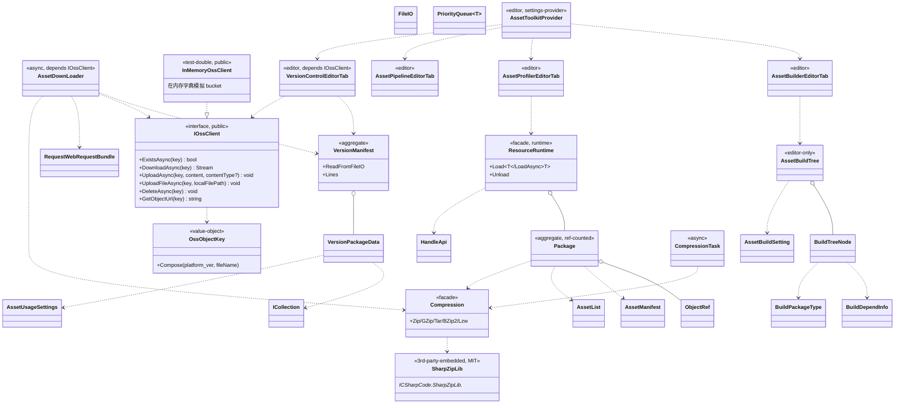

## Positioning

Unity 资源管线工具包。AssetBundle 构建与运行时加载、资源版本管理、压缩（Zip/GZip/Tar/BZip2/Lzw）、远端 OSS 同步、资源 Profiler 与管线检查；UPM 底层包 `com.vena.assets`（vena 命名空间），与 `com.vena.core` / `.framework` / `.world` 平级，**不依赖任何 vena 业务层**。迁移自外部仓库 `github.com/nan023062/vena-asset-toolkit`。

## Class Diagram

**稳定度单向**：`Editor → Manager / VersionControl / AssetBuildTree → { Compression, Oss(IOssClient), Utils }`。OSS 真实实现由业务工程注入；包内只发抽象 + Mock。

## Key Decisions

1. **依赖白名单分层化（与 `com.vena.blockly` Key Decision #2 相反）**：`Runtime/` **允许** `UnityEngine`（资源管线本质就是 Unity API：`AssetBundle` / `Resources` / `Application` / `UnityWebRequest` / `Texture2D` 等无法绕开），**禁** 引其他 vena 包，**禁** 引业务层；`Editor/` 在此之上叠加 `UnityEditor`。`com.vena.blockly` 是「逻辑编排引擎」、本质零 Unity 依赖，故零白名单；本包是「资源管线」、本质强 Unity 依赖，故引擎白名单为 `UnityEngine`。两者结论不同源于「本质职责」不同，不是松紧不同。

2. **第三方源码嵌入约定（SharpZipLib）**：`Runtime/Core/CSharpZipLib/` 嵌入 SharpZipLib 源码（来源 `github.com/icsharpcode/SharpZipLib`，许可 MIT），**保留其原命名空间** `ICSharpCode.SharpZipLib.*`、**不加 vena 版权头、不重命名**；许可证义务双载：包根 `LICENSE.SharpZipLib` 含 SharpZipLib MIT 许可证全文，包根 `THIRD-PARTY-NOTICES.md` 列出来源 / 版本 / 许可。**不发布到 NuGet 或独立程序集**：消费者只引 `Vena.Assets` 一根 asmdef、不感知第三方。

3. **OSS 抽象层（D6 关键决策）**：包内**只**定义抽象接口 `IOssClient`（`Vena.Assets` 命名空间）+ 包内默认 Mock `InMemoryOssClient`；**禁绑定任何具体云厂商 SDK**（外部仓库的 `Aliyun.OSS.dll` 已在迁移时移除）。**理由**：闭源 dll 进通用包是合规风险（License 不明）+ 锁定云厂商（业务方需可换 OSS / S3 / Azure Blob / 自建对象存储）。**注入方式**：Manager / VersionControl 等调用点接收 `IOssClient` 作为构造或方法参数，不内部 `new`；业务工程在自己工程内实现 `IOssClient`（封装 Aliyun.OSS / Amazon.S3 / 任何 SDK）并在初始化期注入。**Mock 用途**：本仓 `unity-project` 内核验、CI、unit 测试；不进生产链路。

4. **命名约定（旧仓 `Vena.AssetToolkit` 整体作废）**：包名 `com.vena.assets`、显示名 `Vena Assets`；asmdef name `Vena.Assets` / `Vena.Assets.Editor`、rootNamespace 同名；C# 命名空间 `Vena.Assets`（`Vena.AssetToolkit` 旧命名空间作废）。外部仓库历史保留 `Vana.AssetToolkit` asmdef 拼写（`Vana` 是历史拼写，本包修正为 `Vena`），属于一次性迁移修复，不留兼容别名。

5. **LICENSE 与归属**：包内 `LICENSE` = MulanPSL-2.0（与 vena 族其他包一致；版权 `Copyright (c) 2024-2026 nan023062`）；外部仓库 `github.com/nan023062/vena-asset-toolkit` 原 MIT 许可证仅在外部仓库继续生效（视为该 repo 历史归档），**不**进 vena monorepo 包内文件。SharpZipLib 嵌入源的 MIT 义务由 `LICENSE.SharpZipLib` + `THIRD-PARTY-NOTICES.md` 双载承担，与包主 LICENSE 互不冲突（vena 主体 MulanPSL-2.0、第三方嵌入 MIT，按文件定位许可）。

6. **OSS 业务核心解耦的物理边界**：原 `Runtime/Core/Oss/OssTool.cs` 与 `OssUploadObject.cs` 这两个直接依赖 `Aliyun.OSS.*` 的文件**不复制**到本包；其职责拆为三处：(a) `IOssClient` 抽象定义放 `Runtime/Oss/IOssClient.cs`；(b) `InMemoryOssClient` Mock 放 `Runtime/Oss/InMemoryOssClient.cs`；(c) URL / Key 构造（旧 `OssTool.GetFileUrl` / `OssTool.GetFileKey`）作为纯字符串拼接逻辑独立成 `OssObjectKey` value object（不依赖任何 OSS SDK、任何 cloud 概念，纯路径拼接）。

7. **Editor 入口依赖 IOssClient 注入**：原 `Editor/VersionControl/AssetVersionManagementEditorTab.cs` 中 `OssTool.UploadPackage(dir.FullName)` 这一处直接静态调用作废；改为 Editor 期通过 `AssetToolkitProvider` 的设置面板让用户配置 `IOssClient` 工厂（默认 `InMemoryOssClient` + 警告横幅 `"Production OSS not configured"`），业务工程通过 `AssetToolkitProvider.SetOssClientFactory(...)` 在 `[InitializeOnLoad]` 期注入真实实现。**禁**在包内硬编码任何 endpoint / accessKey / bucketName。
