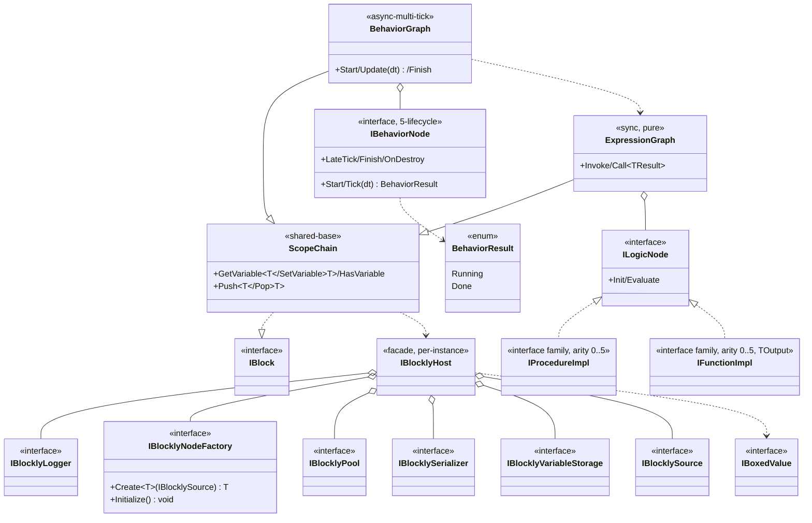

## 定位

逻辑编排引擎。**控制图（Behavior）+ 逻辑图（Expression）双图**，统一表达「时序流转」与「值求值」。

UPM 底层包 `com.vena.blockly`（vena 命名空间），与 `com.vena.core / .math / .world / .framework` 平级。承载函数组合骨架；具体函数经 `IBlocklyHost` 运行期注入。白皮书：`ARCHITECTURE-v2.md`。

## Class Diagram

**稳定度单向**：`BlocklyFrontend → EditorIR → RuntimeEngine`。

## Key Decisions

1. 原子节点 = 函数；行为差异 = 注入哪个函数。
2. 依赖白名单 = 空（零 Vena 业务层 / 零 Unity 引擎）。
3. 控制图调用逻辑图，单向。
4. ScopeChain = 双图共享基础；变量整链唯一。
5. `IBlocklyHost` = 聚合门面；细粒度接口（Logger / NodeFactory / Pool / Serializer / VariableStorageFactory / Source）独立变更原因。
6. 入口 API 接收类型 = `IBlocklyHost`。
7. 对外暴露 = `ScopeChain` + `IBlock` + `IBlocklyHost` + 细粒度接口；`EditorIR` / `BlocklyFrontend` 包内不可见。
8. 调试通道（Phase 2）= 独立接口，与 `IBlocklyLogger` 分离。

## Phase 1 Ratchet

**做**：

1. ScopeChain 抽出为独立子模块；调用方代码零修改。
2. `IProcedureImpl` / `IFunctionImpl` 补齐 0..5 arity；基类包装同步补齐。
3. `IBehaviorNode.Tick` 返回 `BehaviorResult { Running, Done }`；已知节点全量迁移。

**不做**：命名空间改名、物理搬迁、Wait/Delay 节点、协程 / Task / 异步、反射注册表、注解扫描、codegen。

- **Phase 2** = codegen（扫 `[UgcMethod]` / `[UgcProperty]` / `[UgcSource]` 注解导出 Impl 扩展代码）+ 编辑器配置工具

## Phase 2 Ratchet

- Phase 2 第二刀 = IR 序列化（JSON in SO）+ Runtime IR 加载器 + GraphView 双 wire 单画布 + Toolbox + Inspector + 调试通道 v0；不解冻父 §6。

