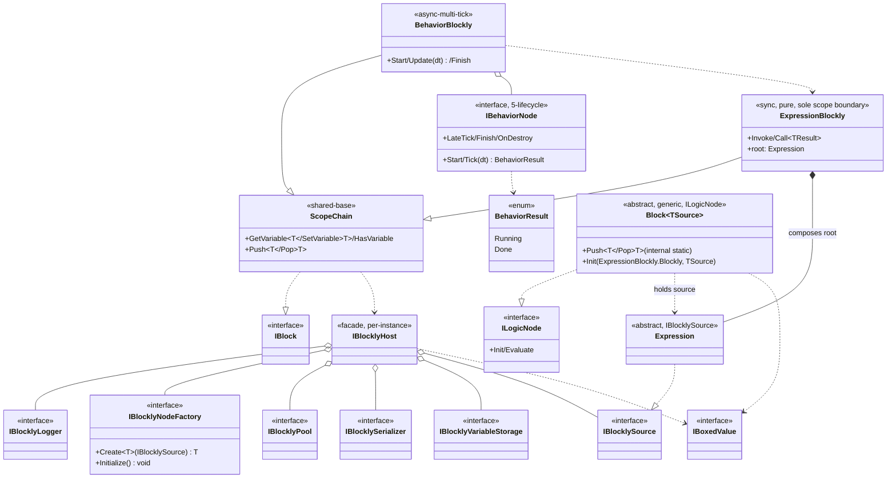

## 定位

逻辑编排引擎。**控制图（Behavior）+ 逻辑图（Expression）双图**，统一表达「时序流转」与「值求值」。

UPM 底层包 `com.vena.blockly`（vena 命名空间），与 `com.vena.core / .math / .world / .framework` 平级。承载函数组合骨架；具体函数经 `IBlocklyHost` 运行期注入。白皮书：`ARCHITECTURE-v2.md`。

**双图运行时类命名**：逻辑图运行时 = `ExpressionBlockly`（原 `LogicGraph`）；行为图运行时 = `BehaviorBlockly`（原 `BehaviorGraph`）。类名去除 `Graph` 词汇歧义、统一以 `Blockly` 后缀标记「运行时可执行图对象」身份。文件名同步：`Runtime/Expression/ExpressionBlockly.cs` / `Runtime/Behavior/BehaviorBlockly.cs`。

## Class Diagram

**关键读图提示**：

- `ExpressionBlockly *-- Expression` = **组合**关系（不是聚合）：一条 `ExpressionBlockly` 持有一棵 `Expression` 树（`root`），控制流节点（`LogicSequence` / `LogicBranch` / `LogicWhile`）的子槽**直接持有 `Expression`**而非 `ExpressionBlockly`——内部控制流不再嵌图（KD#19）。
- `ExpressionBlockly` = **唯一作用域边界**：一条 `ExpressionBlockly` = 一套变量作用域；Behavior 侧 `LogicBehavior` 的 `onStart / onTick / onLateTick / onFinish` 四个槽各自实例化一条独立 `ExpressionBlockly`（因而 ScopeChain 仍存在、用于多条 blockly 之间的变量向上查找）。控制流内部（if/while/sequence 的分支与体）**不创建新作用域**。
- `Block` 接口实现 `ILogicNode`；与父 `Expression` 的依赖方向 = `Block → Expression`（派生 Node 持有强类型 `source: TSource`。一个 `Expression` 派生类内嵌一个 `Block<TSource>` 子类）。

**稳定度单向**：`BlocklyFrontend → EditorIR → RuntimeEngine`。

## Key Decisions

1. 原子节点 = 函数；行为差异 = 注入哪个函数。
2. **依赖白名单 = 空（零 Vena 业务层 / 零 Unity 引擎）——永久铁律，不可解冻。**
   - 短期红利：服务器 AI 推理 / dotnet console 直跑 / 跨平台 IR 传输。
   - **长期红利（产品路径）：runtime UGC 玩家编辑器**——玩家 game build 里没有 `AssetDatabase`、不能造 `ScriptableObject`、只能加载 IR JSON。plain class + IR JSON 是 runtime UGC 唯一可行路径。
   - 一旦解冻 = 关闭 runtime UGC 这条产品路径。任何「让包心引 UnityEngine 一下下」的提案直接驳回；唯一例外见 KD#9 `Tests/` 包内测试目录与 KD#13 `Vena.Blockly.SO` 程序集，且二者均不污染 `Vena.Blockly` 主程序集。
3. 控制图调用逻辑图，单向。
4. ScopeChain = 双图共享基础；变量整链唯一。写路径 lexical resolve，详见合约 §2。
5. `IBlocklyHost` = 聚合门面；细粒度接口（Logger / NodeFactory / Pool / Serializer / VariableStorageFactory / Source）独立变更原因。
6. 入口 API 接收类型 = `IBlocklyHost`。
7. 对外暴露 = `ScopeChain` + `IBlock` + `IBlocklyHost` + 细粒度接口；`EditorIR` / `BlocklyFrontend` 包内不可见。
8. 调试通道（Phase 2）= 独立接口，与 `IBlocklyLogger` 分离。
9. **UnityEngine 在 `Tests/` 包内测试目录的有限例外**：
   - **目录形态**：包根 `Tests/` 是**包内测试目录**，与 `Runtime/` / `Editor/` 平级；**参与 Unity 工程编译**、Unity Project 视图直接显示、可双击打开 scene、可 Play、可触发 Editor 菜单。**不是 UPM Sample**：UPM Package Manager 不识别 `Tests/`、Package Manager 视图不列 import 项；package.json **不含** `samples` 字段、不走 UPM Sample import 路径。开发者验证流程 = 在 Unity 工程内直接打开 `Tests/<DemoName>/` 下的 scene 或 Editor 入口。
   - **业务工程隔离机制**：包心向业务工程暴露 `Tests/` 时，依靠 **4 个独立 asmdef + `autoReferenced=false`** 隔离——`Vena.Blockly.Tests.LogicRuntime` / `Vena.Blockly.Tests.BehaviorRuntime` / `Vena.Blockly.Tests.GraphEditorUI` / `Vena.Blockly.Tests.Codegen` 四个 asmdef 关闭自动引用，业务工程 `Assembly-CSharp` 与业务程序集**默认不 reference 任何 Tests asmdef**、业务代码无法误用 Tests/ 内类型；命名空间 `Vena.Blockly.Tests.<DemoName>` 与 `Vena.Blockly` / `Vena.Blockly.Editor` / `Vena.Blockly.Editor.UI` 平级，业务方一眼可辨「测试代码、非生产 API」。业务工程如需进一步屏蔽 `Tests/` 编译，自行在 package consume 流程内 `.npmignore` / `.gitattributes` 排除子目录；包心**不主动隐藏**（这是用户已知且接受的代价）。
   - **与 UPM `Samples~/` 的差别**：`Samples~/` = UPM 协议识别的 sample 目录、用户经 Package Manager → Import Sample 拷贝到 `Assets/Samples/<Pkg>/<Version>/<Name>/`；`Tests/` = 包内测试目录、随包源直接编译。如未来需把 Demo 出货为 Samples~ 形态须**另行复制**至 `Samples~/` 并补 `package.json` `samples` 字段，与 `Tests/` 不互通。
   - **适用范围**：仅限 `Tests/<DemoName>/` 目录下的测试代码。包心 (`Runtime/`)、`Editor/`、`Editor/UI/` 仍严守 Key Decision #2 的「零 UnityEngine 引擎依赖」，本条**不解冻**任何包心程序集。
   - **允许 using**：`UnityEngine`（`GameObject` / `MonoBehaviour` / `Debug` / `Vector3` / `Time` 等基本设施）；`Vena.Blockly` 及其公开命名空间。
   - **禁止 using**：`Vena.Game.*` / `Vena.UI.*` / 任何项目业务层、任何第三方业务包；不得反向依赖 Editor 程序集。
   - **命名空间**：测试代码挂 `Vena.Blockly.Tests.<DemoName>`；旧 `Vena.Blockly.Samples.*` 命名空间作废、不再使用。
   - **理由**：开发期 Demo 的可演示性必须经由 Unity 的 GameObject / EditorWindow 接入，否则不能形成「打开 scene → Play → 看到行为图运行」或「点菜单 → 看到 codegen 产物落盘」的演示闭环。包心三层（Runtime / Editor / Editor.UI）依赖结构与稳定度分层不变。
   - **强制反例**：Editor 期 Demo（Demo 03 / Demo 04 形态）**不许**采用 sample scene + MonoBehaviour 形态，必须走 EditorWindow / 菜单产出 + GraphAsset 资产形态；即「Editor 期演示用 Editor 程序集落点」、「Runtime 期演示用 `Tests/` MonoBehaviour 落点」两条互不交叉的落点。
   - **执行检查**：(a) `Tests/` 子目录的 asmdef 必须 `references = ["Vena.Blockly"]`、`autoReferenced = false`、`noEngineReferences = false`；不得引用 `Vena.Blockly.Editor` 或任何业务程序集；(b) Editor 形态 demo 的 asmdef `includePlatforms = ["Editor"]`（Unity asmdef 硬约束）；(c) asmdef name 形如 `Vena.Blockly.Tests.<DemoName>`（前缀 `Vena.Blockly.Tests.`，与命名空间一致）；(d) package.json **禁含** `samples` 字段——发现回滚；(e) CI / 人工 review 任何一项失守即视为破坏 Key Decision #2。
10. **NodeFactory `Initialize()` 入父合约**：`IBlocklyNodeFactory` Phase 2 解冻、追加 `Initialize()` 与抽象依赖 `INodeMetadataProvider`；只允许「追加非破坏成员 + 追加抽象依赖」。
11. **Blockly 三层架构（按工作方式切分）**：
    - **Layer 1 — 人手写维护**：包心运行时（`IBlocklySource` / `Expression` / `Block<TSource>` / 求值器 / IR Loader）+ 节点 Impl（`[Blockly]` 标注的核心算法，Method / Property / Field target）。维护方式 = 人写、AI 辅助、人 review。
    - **Layer 2 — 工具自动化**：① **AutoGen Codegen**（`[BlocklySource]` 注解扫描 → `Source` / `Source.Node` 二件套 `.g.cs` + `Provider` 全局产物）；工具本身 Editor-only（`CodeWriter` / `AnnotationScanner` / `CodegenMenu`），产物进 runtime asmdef、被 `BehaviorBlockly` / `ExpressionBlockly` 实例化执行。② **IR Compiler**（图配置 ↔ source 树双向转换）；编辑期 = `JsonGraphSerializer`（IR → JSON），runtime = `GraphLoader`（JSON → source 树，**必须能在 runtime UGC 玩家场景跑**）。维护方式 = ① 人 0 维护（AutoGen 产物挂 `<auto-generated>` 头）、② 工程内基线。
    - **Layer 3 — 人或 AI 用工具编辑可视化**：编辑器 UI（`BlocklyEditorWindow` / `GraphView` / `Toolbox` / `Inspector`），产物 = IR JSON 数据，使用者 = 策划 + AI + 玩家（dual-interface）。
    - **三层依赖单向**：L3 用 L2 的 IR Compiler 编解码 IR + 消费 L2 的节点元数据 → L2 调 L1 抽象注册节点 → L1 不感知 L2/L3。
    - **编辑器形态可换**（Unity Editor / Web / VSCode / runtime UGC）：L1 + L2 不动。这是 KD#2 永不解冻的产品级回报。
12. **维护成本规模**：
    - Layer 1 = 工程内固定基线（一次写好、长期维护）。
    - Layer 2 ① = 0（AutoGen），② = 工程内基线。
    - Layer 3 = 编辑器自身基线 + 配置数据由多产生者分摊（策划 / AI / 玩家）。
    - 含义：「大量内容」由 Layer 3 的多产生者贡献、不计入工程维护成本；工程维护成本封顶在 Layer 1 + Layer 2 ② + Layer 3 编辑器自身。
13. **Source 抽象层 SO/plain 双轨架构**：
    - **接口不动**：`IBlocklySource` 已是最小抽象（`ulong InstanceId`），不变。
    - **泛型约束放宽**：`Block<TSource>` / `BehaviorNode<TSource, TImpl>` 内嵌 `where TSource : Expression` 约束放宽到 `where TSource : IBlocklySource`。
    - **物理边界（D1 = 选项 A）**：新增 `Vena.Blockly.SO.asmdef`——Runtime 形态、`noEngineReferences = false`、依赖 `Vena.Blockly`。含 `SoExpression : ScriptableObject, IBlocklySource` + `SoBehaviorNodeSource : ScriptableObject, IBlocklySource` 抽象基类。`Vena.Blockly` 主程序集仍 `noEngineReferences = true`、零 UnityEngine。
    - **SO 路径覆盖范围（D3）**：仅 (a) Inspector 编辑、(b) 拖拽引用、(c) Project 视图浏览三大开发期 UX 诉求；序列化、Git diff、runtime UGC 仍走自研 IR JSON（KD#11 Layer 2 ②）。SO 不承担存储职能。
    - **依赖方向**：`Vena.Blockly.SO` → `Vena.Blockly`（单向）；plain class 路径与 SO 路径在 `IBlocklySource` 抽象处汇合，互不感知。
14. **`IBlocklySource.InstanceId` 分配责任**（闭合合约 §6 漏洞）：
    - **二层身份语义**：runtime 端 `ulong InstanceId` = **会话内身份键**（类比 Unity `InstanceID`），仅在当前进程 / 当前 host 生命周期内唯一、跨会话不稳定；IR 端 `System.Guid`（128-bit）= **持久身份**，编辑器分配、入盘、永不变。runtime `InstanceId` 由 `InstanceIdAllocator.Next()`（`Interlocked.Increment` fallback）或 `GraphLoader.TrySetInstanceId` 从持久 `System.Guid` 折叠覆盖。两层身份不互换、不混用。
    - **plain class 路径**（`Expression` / `BehaviorNodeSource`）：构造时由 `InstanceIdAllocator.Next()` 自动分配 `ulong InstanceId`；包心负责（D2 = 路径 B）。
    - **SO 路径**（`SoExpression` / `SoBehaviorNodeSource`）：`OnEnable` 时 `Hash64(AssetGuid + fileID)` 派生 `ulong InstanceId`；确定性、跨会话稳定。
    - **IR 加载路径**（`GraphLoader`）：保留现有 `TrySetInstanceId`，折叠 IR 128-bit `System.Guid` → `ulong InstanceId`；维持合约 §6 round-trip 不变量。
    - **`InstanceId = 0` = 未初始化 sentinel**：`Blockly` 注册节点路径应在 `InstanceId == 0` 时抛 `InvalidOperationException("source.InstanceId 未分配")`，让错误前移、信息可读。短期可不做（保持现 `ArgumentException` 二阶现象），长期补。
15. **Phase 3 AOT 暂撑置**：原 Phase 3「IR → C# 编译期固化」**放弃为产品路径**。
    - 理由：runtime UGC 玩家不能走 `.cs` 编译路径（无 Roslyn、无 AssetDatabase、无 IL2CPP 增量编译入口）。
    - 替代：runtime 解释 IR + 编辑器期 codegen（KD#11 Layer 2 ① 二件套 + Provider）。产品路径 = IR JSON 解释执行。
    - 远期开发期可保留「开发者预制图 → `.cs` 编译」作为可选优化通道，但**不进产品路径、不进玩家 build**。任何把 AOT 重新提到产品路径的提案，先回到 KD#2 与 KD#11 检查矛盾。

16. **行为/Timeline 双路径并存**（KD#11 三层架构的精化，**取代上一版「全塌缩」立场**）：
    - **决议**：Behavior 与 Timeline 两侧均保留**两条对等扩展路径**——
      - **ExpressionBlockly 默认路径**（叶子节点把执行逻辑下沉到嵌入的 `ExpressionBlockly`）：Behavior 侧 = `LogicBehavior`（onStart / onTick / onLateTick / onFinish 各挂一条 `ExpressionBlockly`）；Timeline 侧 = `LogicClip`（onBegin / onFrame / onEnd 各挂一条 `ExpressionBlockly`，sealed concrete）。叶子如需复杂算法，由 `[Blockly]` codegen 产出 `*Source + *Source.Node` 二件套登记为 ExpressionBlockly 节点、被嵌入图引用。
      - **C# Impl 业务扩展路径**（业务方在自己的 asmdef 里直接派生模板基类、把行为写在 `TImpl` 里、Inspector 直接配置）：Behavior 侧 = `BehaviorNode<TSource, TImpl>` + `BehaviorNodeSource<TImpl>` + `IBehavior`（已存在、不动）；Timeline 侧 = `Clip<TSource, TImpl>` + `Clip<TSource>` 骨架 + `ClipSource<TImpl>` + `IClip`。
    - **两条路径在 `IBehaviorNode` / `ITimelineClip` 接口处汇合**，调度容器（`CompositeBehavior` / `Timeline.Track`）只看接口、不知道叶子走哪条路径。约束放宽：Behavior 侧 `CompositeBehavior<TSource>` `where TSource : class, IBlocklySource`；Timeline 侧 `Track<TClip, TInput>` / `TrackSource<TClip, TSource>` 约束保持 `TClip : ITimelineClip` + `TInput / TSource : ClipSource, new()`，两条路径都满足。
    - **两条路径分工**：
      - ExpressionBlockly 默认路径 = 玩家 UGC / 策划配图 / AI 生成（Layer 3 多产生者）的主入口；
      - C# Impl 业务扩展路径 = 业务程序员高频改写、希望走 C# 编辑器调试器 / 断点 / 重构工具的叶子算法。
    - **Timeline 侧命名对称**：`LogicBehavior` ↔ `LogicClip`（两侧 ExpressionBlockly 默认叶子）、`BehaviorNode<TSource,TImpl>` ↔ `Clip<TSource,TImpl>`（两侧 C# Impl 业务扩展）。
    - **U 前缀全面清退**：Timeline 命名空间内不再存在 `U` 前缀类型——`UFrameInfo` → `FrameInfo`、`UClipSource` → `ClipSource`、`IUClip` → `IClip`；旧 sealed `UClip` 名让位、改名 `LogicClip`，泛型 Impl 族使用 `Clip<TSource>` / `Clip<TSource,TImpl>` 占用此命名空间。Behavior 侧本来无 U 前缀，对称即成。
    - **理由**：
      - 「ExpressionBlockly 嵌图」与「C# Impl 直写」**变更原因不同**（KD#5 / C2）：前者面向运行期重配置 / UGC / AI 生成；后者面向开发期 C# 工具链 / 性能敏感算法。两条路径满足不同变更原因 = 单一职责的两个模块。
      - 业务侧明示需求：「timeline clip、behaveNode、timelinesignal 都可以业务实现 impl 来更好的配置」——Inspector 直接配置 = 走 SO 路径（KD#13）+ C# Impl 模板，二者协作才能落地。
      - 维护成本：Timeline 侧 Impl 骨架（`IClip` / `ClipSource<TImpl>` / `Clip<TSource>` / `Clip<TSource,TImpl>`）= **4 类一次性写好**，Behavior 侧对应族 `IBehavior` / `BehaviorNodeSource<T>` / `BehaviorNode<TSource,TImpl>` = 现已存在 3 类，对等代价，不构成 KD#11 Layer 1 维护风险。
17. **KD#11 Layer 1 范围精化**（按 KD#16 双路径修订）：
    - **Behavior 侧 Layer 1** = 组合子（`BranchNode` / `SwitchNode` / `SelectorNode` / `LoopNode` / `ParallelNode` / `SequenceNode` / `Timeline` 调度容器）+ `LogicBehavior` 叶子嵌图接线 + `BehaviorNode<TSource,TImpl>` 模板族（4 类骨架）。叶子 Impl 子类**不进** Layer 1（属业务程序员维护、归 Layer 3 业务侧）。
    - **Timeline 侧 Layer 1** = `LogicClip` 嵌图接线（sealed concrete）+ `Signal` 嵌图接线 + `Clip<TSource,TImpl>` 模板族（4 类骨架：`IClip` / `ClipSource<TImpl>` / `Clip<TSource>` / `Clip<TSource,TImpl>`）+ `FrameInfo` 值类型 + `ClipSource` 非泛型基类。Clip Impl 子类**不进** Layer 1。
    - **Logic 侧 Layer 1** = `IBlocklySource` / `Expression` / `Block<TSource>` / 求值器 / IR Loader + `[Blockly]` 标注的核心算法。**不含**任何 `IProcedureImpl` / `IFunctionImpl` / `Procedure<...>` / `Function<...>` 模板族——**已随 Expression 值传递重构删除**（详 KD#18）。
    - **含义**：Behavior/Timeline 上 Layer 1 = 「调度骨架 + ExpressionBlockly 默认接线 + Impl 模板族骨架」三件；「叶子算法手写」分两条：(a) 走 ExpressionBlockly + Logic 侧 `[Blockly]` codegen 输入面、(b) 走 C# Impl 子类（业务程序员负责，包心不维护具体 Impl 子类）。

18. **Expression 值传递机制 = 静态共享调用约定**（取代原 per-`ExpressionBlockly.Blockly` 实例值栈）：
    - **背景**：原设计将值栈挂在 `ExpressionBlockly.Blockly`（原 `LogicGraph.Blockly`）实例上，`Push`/`Pop` 是实例方法；节点求值必须持有 blockly 引用才能拿到栈。带来两个成本：(a) `Block` 基类必须持有 `Blockly` 字段传参，(b) 12 类 `Procedure<TImpl,T1..Tn>` / `Function<TImpl,T1..Tn,TOutput>` 模板族（+ 12 个 `IProcedureImpl` / `IFunctionImpl` 接口族）作为「arity 展开器」寄生在这条协议上。
    - **决议**：值栈上提为 `Expression.Block` 类的 **静态共享栈**（`[ThreadStatic]`），`Push<T>` / `Pop<T>` 改为 `internal static` 成员。`ExpressionBlockly.Blockly.Invoke / Call` 入口记录 `stackDepth` 快照，`finally` 里 pop 回该深度实现异常兜底。
    - **连锁影响**：
      - `Block` 基类改为泛型 `Block<TSource>`，派生 Node 直接持有强类型 `source`，无需运行期 `is TSource ts` 类型检查（编译期保证）。
      - `Procedure<TImpl,T1..Tn>` / `Function<TImpl,T1..Tn,TOutput>` 12 类模板 + `IProcedureImpl<T1..Tn>` / `IFunctionImpl<T1..Tn,TOutput>` 12 个接口全部**删除**——arity 展开由 codegen emitter 直接产出的 Node.Evaluate 内 `Pop<T_N>() ... Pop<T_1>()` 序列完成，无需类型系统承载。
      - `ExpressionBlockly.Blockly._valueStack` / 实例 `Push`/`Pop`/`ClearStack` 全部**删除**。
      - Path A codegen 产物从「三件套（`*Impl` + `*Source` + `*Source.Node`）」坍缩为「二件套（`*Source` + `*Source.Node`）」，`*Impl` 消失，Node.Evaluate 内直接 inline 调用目标 method / property / field。
    - **边界**：本改动只触及 Logic 侧值传递协议 + Path A codegen 产物形态；Behavior / Timeline 侧走 `Call<T>()` 入口不感知底层栈，**不受影响**。
    - **合约影响**：contract §3 值栈接口 + §4 求值协议（原 arity N=5 段）+ §6 节点身份「`IProcedureImpl` 实例」表述**同批更新**；Editor 子模块 §2 Path A 三件套锁**同批更新**为二件套。

## Phase 1 Ratchet

**做**（历史项，Phase 1 已落）：

1. ScopeChain 抽出为独立子模块；调用方代码零修改。
2. ~~`IProcedureImpl` / `IFunctionImpl` 补齐 0..5 arity；基类包装同步补齐。~~ **作废（KD#18）**：整个 Impl 接口族 + `Procedure<>` / `Function<>` 12 类模板已在 Expression 值传递重构中删除；arity 展开由 codegen emit 承担。
3. `IBehaviorNode.Tick` 返回 `BehaviorResult { Running, Done }`；已知节点全量迁移。

**不做**：命名空间改名、Wait/Delay 节点、协程 / Task / 异步。

- **Phase 2** = codegen（扫 `[Blockly]` / `[BlocklySource]` / `[BlocklySourceSlot]` 注解导出 Impl 扩展代码）+ 编辑器配置工具

## Phase 2 Ratchet

- Phase 2 第二刀 = IR 序列化（JSON in SO）+ Runtime IR 加载器 + GraphView 双 wire 单画布 + Toolbox + Inspector + 调试通道 v0；不解冻父 §6。

### codegen 三路径范围

父层只锁「哪些路径属于 codegen」，每条路径的扫描契约 / 产物模板 / 命名规则由 Editor 子模块 `module.md` KD#7 / KD#8 + `contract.md` §2 锁。

| 路径 | scanner 识别 | 产物形态 | PR | 状态 |
|---|---|---|---|---|
| **Path A — Logic** | `[Blockly]` Class target（成员级 Method / Property / Field） | 二件套：`*Source : Expression` + `*Source.Node : Block<*Source>`（Node.Evaluate 内 inline `Pop<T_N>() ... Pop<T_1>()` + 目标调用 + 可选 `Push(result)`）。**KD#18 后无独立 `*Impl` 类**。 | PR-1（初版三件套已落 a128b7e）+ Expression 重构 PR（本轮，坍缩为二件套） | in-progress |
| **Path B — Behavior C# Impl** | `IBehavior` 接口实现类（**反射判定、不依赖 attribute**） | 二件套：`*Source : BehaviorNodeSource<*Impl>` + 嵌套 `Node : BehaviorNode<*Source, *Impl>` | PR-2（已落 fa6e29f / 3f24b89） | done |
| **Path C — Timeline Clip C# Impl** | `IClip` 接口实现类（反射判定，对称 Path B） | 二件套：`*Source : ClipSource<*Impl>` + 嵌套 `Node : Clip<*Source, *Impl>` | PR-3 | 本轮 |

**三路径正交不重叠**：

- Path A 输入面 = 业务方手写的算法承载类（method / property / field），叶子算法走 ExpressionBlockly 内组合；
- Path B / Path C 输入面 = 业务方手写的 `IBehavior` / `IClip` 实现类，叶子算法走 C# Impl 业务扩展路径（KD#16 第二条路径）；
- 三路径 scanner 分支互斥（同一类型不可能同时命中 Path A 与 Path B / Path C：Path A 强制贴 `[Blockly]` + 不允许打在 runtime 节点根类上；Path B 强制实现 `IBehavior` 接口；Path C 强制实现 `IClip` 接口；`IBehavior` 与 `IClip` 是两个独立接口、互不继承）。

**Path B / Path C 镜像对称**：

- 共享 `ScannedSource.ImplSlots / MenuPath` 字段。
- 共享 `AnnotationScanner.CollectImplSlots(Type)` 私有静态方法：字段类型校验（禁 `ExpressionBlockly` / 禁 `Expression`）、`[BlocklySourceSlot]` 读取、order 升序输出。
- 共享 `ComputeDefaultMenuPath(Type)`。
- 共享 `ImplSlotInfo` 镜像 POCO：`FieldName / DisplayName / Order / FieldValueType` 四字段。
- 两路径 emitter 字面**不同**：Path B 产 `BehaviorNodeSource<TImpl>` + `BehaviorNode<TSource, TImpl>`、Init 用 `blockly` 字段；Path C 产 `ClipSource<TImpl>` + `Clip<TSource, TImpl>`、Init 用 `timeline.blockly` 走 timeline 属性 hop。

**Q1 互斥校验 + lifecycle 禁列收口**：Path B / Path C 上 Impl 类与 runtime 节点根类（`BehaviorNode<,>` / `Clip<,>` 等）派生的双向矛盾检测，连同 lifecycle 方法（Behavior 侧 `Start` / `Tick` / `LateTick` / `Finish`；Timeline 侧 `Begin` / `OnFrame` / `End`）上 `[Blockly]` 的硬 fail 规则，由 PR-γ 收口落实（详 Editor §2 Q1.a / Q1.b / Q1.c）；PR-2 / PR-3 本身采用 silent ignore 兜底、PR-γ 后升为 hard fail。
