## 定位

逻辑编排引擎。**控制图（Behavior）+ 逻辑图（Expression）双图**，统一表达「时序流转」与「值求值」。

UPM 底层包 `com.vena.blockly`（vena 命名空间），与 `com.vena.core / .math / .world / .framework` 平级。承载函数组合骨架；具体函数经 `IBlocklyHost` 运行期注入。白皮书：`ARCHITECTURE-v2.md`。

## Class Diagram

```mermaid
classDiagram
    direction TB

    class IBlock {
        <<interface>>
    }
    class ScopeChain {
        <<shared-base>>
        +GetVariable~T~/SetVariable~T~/HasVariable
        +Push~T~/Pop~T~
    }
    class BehaviorGraph {
        <<async-multi-tick>>
        +Start/Update(dt)/Finish
    }
    class IBehaviorNode {
        <<interface, 5-lifecycle>>
        +Start/Tick(dt) BehaviorResult
        +LateTick/Finish/OnDestroy
    }
    class BehaviorResult {
        <<enum>>
        Running
        Done
    }
    class ExpressionGraph {
        <<sync, pure>>
        +Invoke/Call~TResult~
    }
    class ILogicNode {
        <<interface>>
        +Init/Evaluate
    }
    class IProcedureImpl {
        <<interface family, arity 0..5>>
    }
    class IFunctionImpl {
        <<interface family, arity 0..5, TOutput>>
    }
    class IBlocklyHost {
        <<facade, per-instance>>
    }
    class IBlocklyLogger { <<interface>> }
    class IBlocklyNodeFactory {
        <<interface>>
        +Create~T~(IBlocklySource) T
        +Initialize() void
    }
    class IBlocklyPool { <<interface>> }
    class IBlocklySerializer { <<interface>> }
    class IBlocklyVariableStorage { <<interface>> }
    class IBlocklySource { <<interface>> }
    class IBoxedValue { <<interface>> }

    ScopeChain ..|> IBlock
    BehaviorGraph --|> ScopeChain
    ExpressionGraph --|> ScopeChain
    BehaviorGraph o-- IBehaviorNode
    IBehaviorNode ..> BehaviorResult
    ExpressionGraph o-- ILogicNode
    ILogicNode <|.. IProcedureImpl
    ILogicNode <|.. IFunctionImpl
    BehaviorGraph ..> ExpressionGraph
    ScopeChain ..> IBlocklyHost

    IBlocklyHost o-- IBlocklyLogger
    IBlocklyHost o-- IBlocklyNodeFactory
    IBlocklyHost o-- IBlocklyPool
    IBlocklyHost o-- IBlocklySerializer
    IBlocklyHost o-- IBlocklyVariableStorage
    IBlocklyHost o-- IBlocklySource
    IBlocklyHost ..> IBoxedValue
```

**稳定度单向**：`BlocklyFrontend → EditorIR → RuntimeEngine`。

## Key Decisions

1. 原子节点 = 函数；行为差异 = 注入哪个函数。
2. 依赖白名单 = 空（零 Vena 业务层 / 零 Unity 引擎）。
3. 控制图调用逻辑图，单向。
4. ScopeChain = 双图共享基础；变量整链唯一。
5. `IBlocklyHost` = 聚合门面；细粒度接口（Logger / NodeFactory / Pool / Serializer / VariableStorageFactory / Source）独立变更原因。
6. 入口 API 接收类型 = `IBlocklyHost`。
7. 对外暴露 = `ScopeChain` + `IBlock` + `IBlocklyHost` + 细粒度接口；`EditorIR` / `BlocklyFrontend` 包内不可见。
8. 调试通道（Phase 2）= 独立接口，与 `IBlocklyLogger` 分离。
9. **UnityEngine 在 `Tests/` 包内测试目录的有限例外**：
   - **目录形态**：包根 `Tests/` 是**包内测试目录**，与 `Runtime/` / `Editor/` 平级；**参与 Unity 工程编译**、Unity Project 视图直接显示、可双击打开 scene、可 Play、可触发 Editor 菜单。**不是 UPM Sample**：UPM Package Manager 不识别 `Tests/`、Package Manager 视图不列 import 项；package.json **不含** `samples` 字段、不走 UPM Sample import 路径。开发者验证流程 = 在 Unity 工程内直接打开 `Tests/<DemoName>/` 下的 scene 或 Editor 入口。
   - **业务工程隔离机制**：包心向业务工程暴露 `Tests/` 时，依靠 **4 个独立 asmdef + `autoReferenced=false`** 隔离——`Vena.Blockly.Tests.LogicRuntime` / `Vena.Blockly.Tests.BehaviorRuntime` / `Vena.Blockly.Tests.GraphEditorUI` / `Vena.Blockly.Tests.Codegen` 四个 asmdef 关闭自动引用，业务工程 `Assembly-CSharp` 与业务程序集**默认不 reference 任何 Tests asmdef**、业务代码无法误用 Tests/ 内类型；命名空间 `Vena.Blockly.Tests.<DemoName>` 与 `Vena.Blockly` / `Vena.Blockly.Editor` / `Vena.Blockly.Editor.UI` 平级，业务方一眼可辨「测试代码、非生产 API」。业务工程如需进一步屏蔽 `Tests/` 编译，自行在 package consume 流程内 `.npmignore` / `.gitattributes` 排除子目录；包心**不主动隐藏**（这是用户已知且接受的代价）。
   - **与 UPM `Samples~/` 的差别**：`Samples~/` = UPM 协议识别的 sample 目录、用户经 Package Manager → Import Sample 拷贝到 `Assets/Samples/<Pkg>/<Version>/<Name>/`；`Tests/` = 包内测试目录、随包源直接编译。如未来需把 Demo 出货为 Samples~ 形态须**另行复制**至 `Samples~/` 并补 `package.json` `samples` 字段，与 `Tests/` 不互通。
   - **适用范围**：仅限 `Tests/<DemoName>/` 目录下的测试代码。包心 (`Runtime/`)、`Editor/`、`Editor/UI/` 仍严守 Key Decision #2 的「零 UnityEngine 引擎依赖」，本条**不解冻**任何包心程序集。
   - **允许 using**：`UnityEngine`（`GameObject` / `MonoBehaviour` / `Debug` / `Vector3` / `Time` 等基本设施）；`Vena.Blockly` 及其公开命名空间。
   - **禁止 using**：`Vena.Game.*` / `Vena.UI.*` / 任何项目业务层、任何第三方业务包；不得反向依赖 Editor 程序集。
   - **命名空间**：测试代码挂 `Vena.Blockly.Tests.<DemoName>`；旧 `Vena.Blockly.Samples.*` 命名空间作废、不再使用。
   - **理由**：开发期 Demo 的可演示性必须经由 Unity 的 GameObject / EditorWindow 接入，否则不能形成「打开 scene → Play → 看到行为图运行」或「点菜单 → 看到 codegen 产物落盘」的演示闭环。包心三层（Runtime / Editor / Editor.UI）依赖结构与稳定度分层不变。
   - **强制反例**：Editor 期 Demo（Demo 03 / Demo 04 形态）**不许**采用 sample scene + MonoBehaviour 形态，必须走 EditorWindow / 菜单产出 + GraphAsset 资产形态；即「Editor 期演示用 Editor 程序集落点」、「Runtime 期演示用 `Tests/` MonoBehaviour 落点」两条互不交叉的落点。
   - **执行检查**：(a) `Tests/` 子目录的 asmdef 必须 `references = ["Vena.Blockly"]`、`autoReferenced = false`、`noEngineReferences = false`；不得引用 `Vena.Blockly.Editor` 或任何业务程序集；(b) Editor 形态 demo 的 asmdef `includePlatforms = ["Editor"]`（Unity asmdef 硬约束）；(c) asmdef name 形如 `Vena.Blockly.Tests.<DemoName>`（前缀 `Vena.Blockly.Tests.`，与命名空间一致）；(d) package.json **禁含** `samples` 字段——发现回滚；(e) CI / 人工 review 任何一项失守即视为破坏 Key Decision #2。
10. **NodeFactory `Initialize()` 入父合约**：`IBlocklyNodeFactory` Phase 2 解冻、追加 `Initialize()` 与抽象依赖 `INodeMetadataProvider`；只允许「追加非破坏成员 + 追加抽象依赖」。

## Phase 1 Ratchet

**做**：

1. ScopeChain 抽出为独立子模块；调用方代码零修改。
2. `IProcedureImpl` / `IFunctionImpl` 补齐 0..5 arity；基类包装同步补齐。
3. `IBehaviorNode.Tick` 返回 `BehaviorResult { Running, Done }`；已知节点全量迁移。

**不做**：命名空间改名、物理搬迁、Wait/Delay 节点、协程 / Task / 异步、反射注册表、注解扫描、codegen。

- **Phase 2** = codegen（扫 `[UgcMethod]` / `[UgcProperty]` / `[UgcSource]` 注解导出 Impl 扩展代码）+ 编辑器配置工具

## Phase 2 Ratchet

- Phase 2 第二刀 = IR 序列化（JSON in SO）+ Runtime IR 加载器 + GraphView 双 wire 单画布 + Toolbox + Inspector + 调试通道 v0；不解冻父 §6。

