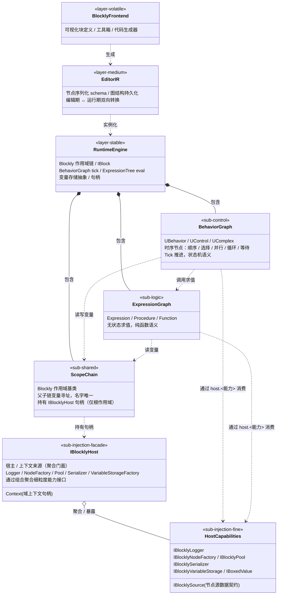

## 定位

逻辑编排引擎。承载「玩法逻辑可被结构化编辑」的能力底座——以**控制图（Behavior）+ 逻辑图（Expression）双图架构**统一表达「时序流转」与「值求值」两类截然不同的计算范式。

**身份**：UPM 底层包 `com.vena.blockly`（目标形态），与 `com.vena.core / .math / .world / .framework` 平级，但**依赖关系完全独立**——不依赖 Vena.World、不依赖 Vena.Framework、零 Unity 引擎依赖。Blockly 只承载「函数组合」的抽象骨架，所有具体函数（无论纯逻辑还是与 Unity / 世界耦合的表现层）都通过宿主在运行时注入。Infinity 业务层（Combat / Match / Agency 等）作为宿主反向消费本包并注入具体函数。

**关键身份声明**：

- 本模块 `.dna/module.md` 描述的是**目标形态**（v2.0 白皮书蓝图），**非 MVP 即落地范围**。当前源码（`Blockly.cs / Behavior/ / Expression/`）已落地双图骨架与作用域链，但 IR、Blockly 前端映射、宿主注入接口均为渐进交付。
- 长文白皮书《逻辑编排架构白皮书 v2.0》落档在本模块目录下 `ARCHITECTURE-v2.md`，是本 `.dna/` 的**叙事来源**。
- 当前源码命名空间仍为 `XDTGame.UGC.Blockly` 且引用一批已不存在的旧符号（`UActor / UObjectSource / IUGraphVariableStorage / UGCWorld / UVariables / IUValue / DebugSystem / LogCategory / UgcSourceAttribute` 等）。这批符号既不在 Vena 中、也不在本仓库中——它们是历史遗留的「未连接的外部锚点」。**修复路径不是去 Vena 找回它们**（它们本就不该是 Blockly 的硬依赖），**而是把它们抽象为 Blockly 自身的注入式接口**：宿主在装配期注入具体实现，纯逻辑实现 / 与 Unity 耦合的实现各自独立。

## Class Diagram



**三层稳定度分层**（依赖单向，不可反向）：

| 层 | 稳定度 | 变更频率 | 角色 |
|---|---|---|---|
| RuntimeEngine | 最稳定 | 季度级 | 执行语义、生命周期、作用域、tick 协议、宿主聚合门面 IBlocklyHost、细粒度注入接口 |
| EditorIR | 中等 | 月级 | 序列化 schema、图结构持久化、双向转换 |
| BlocklyFrontend | 最易变 | 周级 | UI 块定义、工具箱、代码生成 |

**双图职责边界**：

- **控制图（Behavior）** 回答「**何时**做」——时序、状态、副作用，节点持有内部状态，按 tick 推进。
- **逻辑图（Expression）** 回答「**值是什么**」——纯函数求值，节点无状态，每次求值幂等。
- 控制图调用逻辑图（`BehaviorGraph ..> ExpressionGraph`），反向**禁止**——逻辑图触发副作用就是范式污染。

**宿主与上下文边界**：

- 每个 Blockly 实例归属于一个 **IBlocklyHost**（宿主 / 上下文来源）。宿主即上下文句柄（`Context`）的来源，也是所有运行期能力（Logger / NodeFactory / Pool / Serializer / VariableStorageFactory）的归口。
- 入口 API 只接收 `IBlocklyHost`，**不再裸传 `object`、不再裸传 `UActor`**：`Start(IBlocklyHost host)` / `SetHost(IBlocklyHost host)`。
- 纯逻辑场景由「纯逻辑宿主」实现 IBlocklyHost（默认 NullLogger / Activator 节点工厂 / 无池 / DictionaryVariableStorage / Context = 业务侧任意 POCO）；表现场景由「Unity 耦合宿主」实现同一接口（Logger 路由到 UnityEngine.Debug、NodeFactory 路由到 prefab 池、Context = Actor / World 句柄）。两者实现同一 IBlocklyHost，对 Blockly 内核透明。

## Key Decisions

### 1. 函数组合是 Blockly 的本质，与 Unity 解耦是结论而非妥协

白皮书 §2.5 已声明：「逻辑图 = C# 的 `Func<T1, T2, TResult>` 委托链；逻辑图节点 = 委托链中的一个函数调用；逻辑图执行 = 调用委托返回结果」。所有原子节点（Procedure / Function）都是函数。**注入哪个函数决定了节点的行为**——纯逻辑函数（数学运算、布尔比较）无副作用、不碰 Unity；表现函数（移动 Actor、播音效）与 Unity / 世界耦合。耦合只发生在「被注入的具体函数」那一层；Blockly 核心对这两类函数无差别、零依赖。**这是把 Blockly 包变成纯抽象底座的根本理由**。

### 2. 之前「缺失符号由 Vena 提供」假设被证伪，依赖边界向内收缩

上一轮迁移计划假设 `UActor / UObjectSource / IUGraphVariableStorage / UGCWorld / UVariables / IUValue / DebugSystem / LogCategory / UgcSourceAttribute` 由 Vena 提供，需要 `Vena.Blockly` asmdef 引用 `Vena.World / Vena.Framework`。**全仓 grep 表明 Vena 包内不存在任何这些符号**——既不在 Vena.Core，也不在 Vena.World，也不在 Vena.Framework。它们是 XDFramework 时代的遗留锚点。修复方向不是去 Vena 找回它们，而是按本模块自身职责重新抽象。结论：**Blockly 包的最终依赖目标是「零 Vena 依赖、零 Unity 引擎依赖」**。

### 3. 旧符号到 Blockly 自身抽象接口的对应关系

按「函数注入 + 宿主归口」原则把旧符号一一就位。**所有运行期能力接口由 `IBlocklyHost` 聚合暴露**：Blockly 定义细粒度接口（满足 C4 接口隔离），`IBlocklyHost` 由细粒度接口组合而成（满足 C1 单一门面 + C5 共同复用）。消费者按需取用 `host.Logger` / `host.NodeFactory` / `host.Pool`，不强制依赖完整门面。

| 旧符号 | 新归宿 | 类型 | 实现责任 |
|---|---|---|---|
| `UActor` | **删除**——Blockly 不感知 Actor。原 `Blockly.actor` 字段改为持有 `IBlocklyHost host` 句柄；业务侧需要的「上下文」（原 Actor / World 引用）走 `host.Context`（泛化 `object` 或泛型 `TContext`，具体类型对 Blockly 透明） | Blockly 抽象 | Blockly 定义 IBlocklyHost；业务侧提供宿主实现 |
| `IUGraphVariableStorage` | `IBlocklyVariableStorage`（细粒度接口） + `IBlocklyVariableStorageFactory`（宿主上的工厂能力面）；默认实现 `DictionaryVariableStorage` 在包内 | Blockly 抽象 | Blockly 定义；默认实现包内 |
| `IUValue` / `UValue<T>` | `IBoxedValue` / `BoxedValue<T>`（接口 + 默认池化实现） | Blockly 抽象 | 全在包内 |
| `UVariables` | 默认 `DictionaryVariableStorage` 实现 | Blockly 内部 | Blockly 内部 |
| `UObjectSource` | `IBlocklySource`（节点源数据契约：`ulong Guid` + 源数据基类标记） | Blockly 抽象 | Blockly 定义 |
| `UGCWorld.CreateInstance/GetFromPool/BackToPool` | `IBlocklyNodeFactory` / `IBlocklyPool`（细粒度接口），由 `IBlocklyHost.NodeFactory` / `IBlocklyHost.Pool` 暴露 | Blockly 抽象 | Blockly 定义；宿主可选注入池实现，否则默认 `Activator.CreateInstance` |
| `DebugSystem.LogXxx` + `LogCategory` | `IBlocklyLogger`（最小日志接口：Debug / Warning / Error），由 `IBlocklyHost.Logger` 暴露；旧的全局 `Blockly.LogXxx` 静态函数裁撤，统一走 `scope.Host.Logger` | Blockly 抽象 | Blockly 定义；Infinity 侧通过 `Vena.Debug` 适配后在宿主中返回 |
| (预留) 序列化 / IR 转换 | `IBlocklySerializer`，由 `IBlocklyHost.Serializer` 暴露 | Blockly 抽象 | Blockly 定义；默认实现可为 No-op 或 JSON |
| `UgcSourceAttribute / UgcSourceProperty / UgcClass / UgcMethod / UgcProperty / ExpressionSignatureAttribute` | 留在 Blockly 包内（它们就是 Blockly 自身的元数据约定，本就不该外借） | Blockly 自有 | Blockly 内部 |

这套接口定义后，Blockly 核心代码不再 `using` 任何外部命名空间（除 `System.*`）。

### 4. 命名空间与 asmdef 边界

- 顶级命名空间统一从 `XDTGame.UGC.Blockly` 改为 `Vena.Blockly`；样例从 `XDTGame.UGC.Blockly.Samples` 改为 `Vena.Blockly.Samples`。
- `Vena.Blockly.asmdef`：`references` **空集**（`noEngineReferences = true`）。这是 Vena.World 已经验证过的形态。
- `Vena.Blockly.Samples.asmdef`（独立子 asmdef）：仅引用 `Vena.Blockly`；样例中含 `UnityEngine.Vector3 / UnityEngine.Header` 的部分搬到 Infinity 侧消费，或在 Samples 内通过条件编译 / 纯类型替换隔离。

### 5. 双图架构非 ECA

ECA（Event-Condition-Action）把三者打包进单一节点，控制流被埋在条件分支里，复杂逻辑不可视。本架构显式拆分：事件入口由控制图根节点承担，条件由逻辑图求值，行为由控制图叶节点执行。详细对比见 `ARCHITECTURE-v2.md` §「与 ECA 对比」。

### 6. 三层稳定度分层是依赖方向的设计前提

`BlocklyFrontend → EditorIR → RuntimeEngine` 单向依赖。运行时引擎不感知 Blockly 是否存在——理论上可被任何前端（脚本/AI 生成/外部 DSL）替代。这是单向依赖与稳定抽象原则的联合落地。

### 7. 作用域链作为双图共享基础

`Blockly` 类作为作用域基类被两图共享：变量在父子作用域链上寻址，**整链不能重名**——这是控制图的局部变量与逻辑图的求值上下文统一的语义基础。详见 `Blockly.cs`。

### 8. 文档分工：白皮书叙事，`.dna/` 蒸馏

《白皮书 v2.0》（`ARCHITECTURE-v2.md`）承载长文叙事：设计哲学、节点类型枚举、Blockly 映射示例、与 ECA 对比、边界讨论。`.dna/module.md` 只承载定位 + 类图 + 关键决策。**不允许**把白皮书章节复制进 `.dna/`——重复即漂移源。当 `module.md` 与白皮书冲突时，**白皮书是真相来源**（演化更频繁），`module.md` 跟进蒸馏。

### 9. 对外暴露：仅 Runtime 接口 + IBlocklyHost 单一门面

对外（Infinity 业务层为主要消费者）只通过三件事与本模块交互：

1. **作用域 + 节点契约** —— `Blockly` 作用域类、`IBlock` 接口；
2. **宿主单一门面** —— `IBlocklyHost`：Start / SetHost 等入口 API **只接收 `IBlocklyHost`**，绝不裸传 `object` 或 `UActor`；
3. **细粒度能力接口** —— `IBlocklyLogger / IBlocklyNodeFactory / IBlocklyPool / IBlocklySerializer / IBlocklyVariableStorage / IBoxedValue / IBlocklySource`：业务侧实现这些接口，再由其 `IBlocklyHost` 实现聚合返回。

EditorIR 与 BlocklyFrontend 是包内部实现，外部不可见。本模块**不可反向依赖任何业务层、Vena.World、Vena.Framework、Unity 引擎类型**（`Infinity.* / Combat / Match / Agency / Foundation / Vena.World / Vena.Framework / UnityEngine` 均不可出现在 `using` 中）。

### 10. UPM 包形态与文件物理位置

本模块以 UPM 包 `com.vena.blockly` 发布，目标物理位置 `External/Vena/com.vena.blockly/`，通过 `UnityProject/Packages/manifest.json` 以 `file:` 协议引入。当前源码仍在 `UnityProject/Assets/Scripts/Blockly/` 旧位置——物理迁移与命名空间/接口重构是**两个正交动作**，迁移计划允许先在原位完成接口重构（解开外部锚点），再做物理搬迁，避免一次性大爆炸。

### 11. IBlocklyHost：聚合门面，而非合并接口

**问题**：日志 / 节点工厂 / 池 / 序列化 / 变量存储工厂 这些注入点，是合并进 `IBlocklyHost` 一个大接口（成员就是 Log / Create / Get / Serialize / NewStorage 等方法），还是保留细粒度接口、由 `IBlocklyHost` 聚合持有？

**结论**：**保留细粒度接口，`IBlocklyHost` 聚合（组合）它们作为属性面，不做方法合并**。结构形如：

```
public interface IBlocklyHost {
    object Context { get; }                              // 域上下文（原 Actor 句柄的归宿）
    IBlocklyLogger Logger { get; }
    IBlocklyNodeFactory NodeFactory { get; }
    IBlocklyPool Pool { get; }                           // 可为 NoPool 默认实现
    IBlocklySerializer Serializer { get; }               // 可为 NoOp 默认实现
    IBlocklyVariableStorageFactory VariableStorageFactory { get; }
}
```

**理由**：

| 维度 | 合并大接口 | 聚合门面（采纳） |
|---|---|---|
| C1 单一门面 | 满足 | 满足（`IBlocklyHost` 仍是入口的唯一类型） |
| C2 单一职责 | **违反**——一个接口承担五种变更原因（换 logger / 换池 / 换序列化器 各自都要改这一个接口） | 满足——细粒度接口各自一个变更原因；`IBlocklyHost` 自身只在「能力清单变化」时才改（极少） |
| C4 接口隔离 | **违反**——只用日志的内部节点也要依赖整个大接口表面 | 满足——节点写 `host.Logger.Warning(...)`，类型上只接触 `IBlocklyLogger` |
| C5 共同复用 | 满足（共同装配） | 满足（同一宿主在装配期一次性提供） |
| C6 稳定抽象 | `IBlocklyHost` 体积大、变更原因多，反而不稳定 | `IBlocklyHost` 聚合稳定接口，自身极稳定；细粒度接口各自独立演化 |
| 默认实现成本 | 每加一个能力，所有现有 host 实现都要补方法 | 提供 `BlocklyHostBase` 抽象类给出默认值（NullLogger / ActivatorNodeFactory / NoPool / NoOpSerializer / DictionaryVariableStorageFactory），具体宿主只覆盖需要的能力 |
| 测试 mock | 必须 mock 整个大接口才能测一个节点 | 只 mock 用到的细粒度接口 |

**纯逻辑宿主**：继承 `BlocklyHostBase`，仅设置 `Context`。**Unity 耦合宿主**：继承 `BlocklyHostBase`，覆写 `Logger`（路由到 `UnityEngine.Debug`）、`NodeFactory`（路由到 prefab 池），`Context` 设为 Actor / World 句柄。两者实现同一 `IBlocklyHost`，对 Blockly 内核透明——这就是「函数注入」原则在装配层的具体落地。
