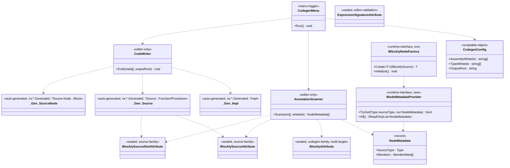

## 定位

Blockly Editor 工具链。Editor 期扫描 Runtime 程序集 + 白名单注解，生成 `IProcedureImpl` / `IFunctionImpl` 胶水代码与节点元数据；运行期通过 `IBlocklyNodeFactory.Initialize()` 反射注册一次。

父模块 §7 非冻结清单第 1/2/3/4/7 项由本子模块锁。

## Class Diagram



**依赖单向**：`Editor → Runtime`；`Runtime → Editor` 禁止。`INodeMetadataProvider` / 产物三件套均落 Runtime；产物**通过命名空间 `<SourceNs>.Generated` 自识别身份**（无 marker attribute），词汇由 Editor 合约 §1、§2 锁。

> **工具类命名规则**（KD#11）：Editor codegen 内部工具类不携带 `Ugc` 前缀，也不携带 `Blockly` 前缀——裸名交给命名空间 `Vena.Blockly.Editor` 去区分。`Blockly*` 前缀专供 KD#7 注解族 4 件（`BlocklySource` / `BlocklySourceSlot` / `Blockly` / `ExpressionSignature`）。

## Key Decisions

1. codegen 模式 = Editor 菜单触发 `.cs` 写盘。
2. 落点推导：**per-source-class** = `<源类.cs 所在目录>/Generated/<源类名>.g.cs`（普通目录、入 git、文件头 `// <auto-generated>`）。产物文件路径 ≡ 命名空间 `<SourceNs>.Generated` 的末段映射。全局 Provider 产物另落点见 KD#12。
3. 白名单 = ScriptableObject `Editor/Config/CodegenConfig.asset`（程序集 + 类型双白名单）。
4. 反射注册 = `IBlocklyNodeFactory.Initialize()` per-host 首次扫程序集 + 加载 `INodeMetadataProvider` 实现，幂等。
5. 新增运行期接口 = `INodeMetadataProvider`：`bool TryGet(Type sourceType, out NodeMetadata)` + `IReadOnlyList<NodeMetadata> All()`；生成代码实现、运行期消费。
6. 依赖 = Editor → Runtime 单向；Runtime → Editor 禁止；生成产物落 Runtime 目录、不引 Editor 命名空间。
7. **注解名锁（2 族 + 1 编辑器校验族；共 4 件）**：
   - **Source 族（手写 runtime 节点源 + 槽位）**：
     - `[BlocklySource(menuPath, nodeType)]`——`AttributeTargets.Class`，贴在手写的 runtime 节点源类（Expression / BehaviorNodeSource 子类）上、为节点注册托底。
     - `[BlocklySourceSlot(displayName, order)]`——`AttributeTargets.Field | AttributeTargets.Property`，贴在手写 Source 类**或 IBehaviorImpl / IClip 实现类**的字段/属性上，描述槽位与 `order` 锁。**Path B (本 PR-2) / Path C 补充**：在 IBehaviorImpl / IClip 实现类上使用，由 scanner Path B/C 分支读取、镜像到产物 `*Source` 上。
   - **Codegen 族（玩法代码标，给 codegen 生成胶水）**：
     - `[Blockly(displayName)]` / `[Blockly(displayName, isStatic, params parameterNames)]`——**multi-target**：`AttributeTargets.Class | Method | Property | Field`。scanner 用 `MemberInfo.MemberType` 分支处理 Class / Method / Property / Field；其中 `isStatic` / `parameterNames` **仅 Method target 有意义**，其他 target 上由 scanner 忽略。
   - **编辑器校验族（不动）**：`[ExpressionSignature]` / `[ExpressionSignature(returnType)]` / `[ExpressionSignature(returnType, params Type[])]`——`AttributeTargets.Field | Property`，LogicGraph 槽位签名约束，仅供编辑器连接期校验。
   - **联动字段（4 件统一）**：全部 `sealed`、`Inherited=false, AllowMultiple=false`。
   - **产物身份 = 命名空间隔离（无 attribute marker）**：产物三件套 / 二件套均落 `<SourceNs>.Generated` 命名空间、人类一眼即辨「这是产物」；IDE / grep / stack trace 都以 `*.Generated` 为产物身份判据。**不再使用任何 `[BlocklyGenerated]` attribute**——原「输出 marker」设计作废、attribute 与词汇不再存在。详见 KD#12。
   - **scanner 分支三路径（详见 KD#18）**：
     - **Path A — Logic**：`type.GetCustomAttribute<BlocklyAttribute>() != null` && `IsClass && !IsAbstract` → 三件套产物。
     - **Path B — Behavior C# Impl**：`typeof(IBehaviorImpl).IsAssignableFrom(type)` && `IsClass && !IsAbstract` → 二件套产物（`*Source : BehaviorNodeSource<*Impl>` + 嵌套 `Node : BehaviorNode<*Source, *Impl>`）。**不依赖 `[Blockly]` attribute**：Impl 类上的 `[Blockly]` 被 Path B 分支完全忽略（含 `displayName` 字段），menuPath 走 `ComputeDefaultMenuPath(Type)` 默认规则。
     - **Path C — Timeline Clip C# Impl**（PR-3 补）：`typeof(IClip).IsAssignableFrom(type)`——对称 Path B、本 PR-2 不动。
     - **互斥语义**：同一类不可能同时命中 Path A 与 Path B（Path A 要求贴 `[Blockly]` + 不能是 runtime 节点根类；Path B 要求实现 `IBehaviorImpl`、与 Path A 的 runtime 节点根类检查并不冲突但语义不交叠）。Q1.b 互斥硬检验（业务类同时从 runtime 根类派生且实现 `IBehaviorImpl`）留给 PR-γ，本 PR-2 不做。
   - **Q1 硬约束（scanner 层 hard fail，详见合约 §2「scanner 硬约束」）**：
     1. 同一类上 `[Blockly]` 与 `[BlocklySource]` 不允许同存——两族正交、混标语义未定义。
     2. `[Blockly]` 不允许打在「run-time 节点源类」上——即继承自 `Vena.Blockly.Expression` 或 `Vena.Blockly.BehaviorNodeSource` 的类不可携 `[Blockly]`；嵌套 Node 实现类的基类 `Vena.Blockly.Block<TSource>` / `Vena.Blockly.BehaviorNode<TSource, TImpl>` 同列。
     3. 违者由 `AnnotationScanner` 抛 `InvalidOperationException("[Vena.Blockly] {TypeFullName}: [Blockly] 不允许与 [BlocklySource] 同存 / 不允许打在 runtime 节点类")`，整个 codegen run 中止，错误信息显式包含违例类型全名以方便定位。
   - **废除注解清单**：
     - `[BlocklyCodeGen]` / `[BlocklyClass]` → 并入 `[Blockly]`（Class target）。
     - `[BlocklyCodeGenMethod]` / `[BlocklyMethod]` → 并入 `[Blockly]`（Method target）。
     - `[BlocklyCodeGenMember]` / `[BlocklyProperty]` → 并入 `[Blockly]`（Property / Field target）。
     - `[BlocklyGenerated]` → 无取代，产物身份走命名空间隔离（KD#12）。
8. **codegen 产物形态（两路径并存）**：
   - **Path A 三件套（Logic）**：`*Impl`（0-arity `IFunctionImpl<TOutput>` / `IProcedureImpl`） + `*Source`（0 泛型 arity `Function<*Impl, TOutput>` / `Procedure<*Impl>`） + `*Source.Node`（`Block<*Source>` 子类，手动 Pop）。三件均落 `<SourceNs>.Generated` 命名空间、`<SourceDir>/Generated/<源类名>.g.cs` 文件。Pop 顺序 ≡ IR 顺序 ≡ UI 顺序 ≡ `[BlocklySourceSlot.order]` 升序（Pop = LIFO 反序）。实例方法示例源类落点：`Tests/04_Codegen/Scripts/InstanceMethod.cs`，产物落点：`Tests/04_Codegen/Scripts/Generated/InstanceMethod.g.cs`。
   - **Path B 二件套（Behavior C# Impl，Scenario Y）**：`*Source : BehaviorNodeSource<*Impl>`（含 slot 镜像字段 **类型统一为 `LogicGraph`** + `[BlocklySource(menuPath, typeof(*Source.Node))]`） + 嵌套 `Node : BehaviorNode<*Source, *Impl>`（持每 slot 一个 `LogicGraph.Blockly` 私有局部；`Initialize / InitializeProperties / CleanProperties / OnBeforeDestroy` 4 个 override：Init 调 `blockly.CreateBlockly(source.field)` / InitProps 调 `_field.Call<TValueType>()` 塞 Impl 字段 / Clean 引用型置 null / OnBeforeDestroy 调 `blockly.DestroyBlockly(_field)` 释放）。**无 `*Impl`产物**——`*Impl` = 业务方手写的 IBehaviorImpl 实现类、codegen 不产。二件均落 `<SourceNs>.Generated` 命名空间、`<SourceDir>/Generated/<源类名>.g.cs` 文件（源类 = Impl 类）。Slot 读取来源 = Impl 类上的 `[BlocklySourceSlot]` 字段。**字段类型双轨锁**：Impl 字段必须实际值类型（值型 / Unity 对象引用 / string 等）、**禁 LogicGraph**、**禁 Expression**；*Source 字段统一 `LogicGraph`。详见 KD#15 + KD#18 + 合约 §2.5。
   - **同一源类**不可能同时产三件套与二件套（Path A / Path B scanner 分支互斥）。**不同源类**可以一个走 Path A、另一个走 Path B，同一程序集内两种产物并存不冲突。
   - **场景 ζ（成员级 `[Blockly]` 并存）**：Impl 类内非 lifecycle 方法 / 属性 / 字段标 `[Blockly]` → 同时走 Path A 三件套 emitter、与 Path B 二件套并存于同一 .g.cs。lifecycle 方法（`Start` / `Tick` / `LateTick` / `Finish`）4 名锁，上面打 `[Blockly]` silent ignore（不报错、不产，Q1 hard fail 留给 PR-γ）。
9. **发布者身份字样**（`.g.cs` 顶部文件头）：产物文件头身份字样 = `"Generated by the com.vena.blockly Blockly codegen pipeline."`；合约 §2 产物文件头 hard rule 锁定，仅保留 `<auto-generated>` 7 行 prelude、**不再贴任何 `[BlocklyGenerated]` attribute**。**不提 `UGC`**——`UGC` 是产品语义（KD#2 runtime UGC 玩家），不作为工具身份。
10. **菜单路径**：`Tools/Vena/Blockly/Run Codegen` + `Tools/Vena/Blockly/Locate Codegen Config`；`[CreateAssetMenu] menuName = "Vena/Blockly/Codegen Config"`；资产默认文件名 `BlocklyCodegenConfig.asset`（资产文件名保留 `Blockly` 前缀以避免开发环境项目全局名冲突；类名 `CodegenConfig` 裸命名，由命名空间区分）。
11. **工具类命名规则**（Editor 内部）：Editor codegen 工具类不携带 `Ugc` 前缀、不携带 `Blockly` 前缀——裸名交给命名空间 `Vena.Blockly.Editor` 去区分。适用于：`AnnotationScanner` / `CodeWriter` / `CodegenMenu` / `CodegenConfig`。
    - **理由**：（1）命名空间已承载 Blockly 身份，类名重复前缀 = 命名冗余（C2/C5）；（2）`Blockly*` 前缀保留给 KD#7 注解族 4 件（`BlocklySource` / `BlocklySourceSlot` / `Blockly` / `ExpressionSignature`），不随意混入内部工具类名以维持「公开词汇 vs 内部工具」边界；（3）`Ugc` 是产品语义（KD#2 runtime UGC 玩家编辑器）、不可同时作为 Editor 期开发者工具的命名前缀——二者使用者不同（`Ugc` = 玩家；codegen = 开发者 + AI），混用会误导「工具供 UGC 玩家使用」。
    - **作用面**：仅 Editor 内部工具类；Runtime 内 `UGCWorld` 等产品语义概念不受本规则约束（依然保留 `UGC` 字样）。
12. **产物身份 = 固定后缀命名空间隔离**（取代 `[BlocklyGenerated]`）：
    - **命名空间规则**：对源类 `T`（`T.Namespace = <SourceNs>`）的所有产物 = `namespace <SourceNs>.Generated { ... }`。例源类 `Vena.Blockly.Tests.Codegen.InstanceMethod` → 产物 `namespace Vena.Blockly.Tests.Codegen.Generated`；产物类全限定名 `Vena.Blockly.Tests.Codegen.Generated.InstanceMethodTestMethod` / `.InstanceMethodTestMethodImpl`。选型理由 = (a) 同名碰撞自动消解（跨业务域 `Order.Process` 不互撞）；(b) IDE 入眼即辨「末段 `.Generated` = 产物」；(c) 与源类同 root 包，`using` 路径连贯。
    - **文件路径规则**：产物文件落 `<SourceDir>/Generated/<源类名>.g.cs`（文件夹 ≡ 命名空间末段，C# 业界惯例）。例：`Tests/04_Codegen/Scripts/InstanceMethod.cs` 源 → `Tests/04_Codegen/Scripts/Generated/InstanceMethod.g.cs` 产物。`<SourceDir>` 由 scanner 从 `Type.Assembly.Location` + asmdef 路径解析出。
    - **Provider 产物例外**：`GeneratedNodeMetadataProvider.g.cs` 跨源类聚合、不属于任一 `<SourceNs>`；落点 = `CodegenConfig.OutputRoot`（默认 `${PackagePath}/Runtime/Generated/`）；命名空间 = `Vena.Blockly.Generated`（固定根、作为 Provider 只点身份区分）。仅 Provider 一个产物使用该根 ns，三件套 / 二件套不走这里。
    - **scanner 过滤契约**：**Path A** = 「`type.GetCustomAttribute<BlocklyAttribute>() != null && memberType == Class`」；**Path B** = 「`typeof(IBehaviorImpl).IsAssignableFrom(type)`」；不加 belt-and-suspenders。产物 `*Source` / `*Impl`（Path A） / `*Source.Node` / Provider 均不贴 `[Blockly]` 且不实现 `IBehaviorImpl` → 天然不命中过滤、不发生递归 codegen。「防递归生成」是伪需求。**保留**：`[BlocklySource]` 跳过（`AnnotationScanner.cs` 现第 54 行），语义为「手写运行期节点源不是 codegen 输入」的正交过滤、非防递归防御。
    - **AOT 不变量契约**（锁合约 §4.6 第 1 条修订）：`sourceType` 解析限于「携 `[BlocklySource]` 且命名空间末段为 `.Generated` 」的产物 `*Source` 与手写 Source；原「+ `[BlocklyGenerated]`」词汇废。
13. **Path B / Path C 位置判据（补 PR-γ 位送）**：Path B 位置走「接口实现」反射检查、不走准入 attribute。原因是 Behavior / Timeline 侧业务方希望「只写 Impl 类、不必填任何 attribute」的门槛低于 Path A（后者要求业务方主动标 `[Blockly]` 以表达「这个 method/property/field 是节点」的意图）。Path B 门槛以「是否实现 `IBehaviorImpl`」作为唯一判据；Impl 类上的 `[Blockly]` 被 Path B 完全忽略（含 `displayName` 字段）。
14. **Path B / Path C menuPath 计算规则（`ComputeDefaultMenuPath(Type)`）**：Path B / Path C 由于不读 `[Blockly]`，menuPath 走**默认命名空间推导**：
    - 算法：取 `Type.FullName` → 剩类名 `Impl` 后缀 → 剥 `Vena.Blockly.` 命名空间前缀（如有） → 命名空间内部 `.` 折叠为 `/`。
    - 例：`Vena.Blockly.Tests.BehaviorRuntime.HelloBehaviorImpl` → 去后缀 → `Vena.Blockly.Tests.BehaviorRuntime.HelloBehavior` → 去前缀 → `Tests.BehaviorRuntime.HelloBehavior` → `.` → `/` → `Tests.BehaviorRuntime/HelloBehavior`（末段类名作为叶、前面 namespace 作为路径）。
    - 另一例：`MyGame.Skills.FireballImpl` → `FireballImpl` 去 `Impl` = `Fireball` + ns `MyGame.Skills` → `MyGame/Skills/Fireball`。
    - **类名末 `Impl` 后缀不是硬性要求**：业务侧 `Foo` 类仅实现 `IBehaviorImpl` 也合法，仅按照完整类名推 menuPath（未去后缀）。“去 Impl”是 best-effort 净化、不强制。
    - **实现点** = `AnnotationScanner.ComputeDefaultMenuPath(Type type)` 静态方法，仅供 Path B / Path C 调用。
    - **不允许业务侧覆盖**：本 PR-2 锁「默认 menuPath 由命名空间推」，不提供 attribute / config / hook 覆盖。未来如需覆盖另起 KD，不隐式开口。
15. **Path B / Path C 字段类型双轨锁（Scenario Y）**：
    - **Logic Path A 字段** = `Expression`（走 LogicGraph 5 步协议、Push/Pop）。
    - **Behavior Path B / Timeline Path C Impl 类字段** = **必须**实际值类型：基元值型（`bool` / `int` / `float` / `string` / `enum` 等）、结构体（`Vector3` / `Quaternion` 等）、或 `UnityEngine.Object` 派生引用（`GameObject` / `Transform` 等）。**禁止 LogicGraph**——Impl 字段是「求值结果」、不是 LogicGraph 引用。**禁止 Expression**——Behavior / Timeline 侧无 5 步协议栈。
    - **Behavior Path B / Timeline Path C Source 类字段（codegen 产物）** = **统一 `LogicGraph` 类型**，无论 Impl 字段是值型还是引用型。无例外、无新约定决定何时转译。
    - **Init 求值机制**：codegen 在 `Node.Initialize()` 内调 `_<field> = blockly.CreateBlockly(source.<field>)` 创建 LogicGraph.Blockly 实例；在 `Node.InitializeProperties(impl)` 内调 `impl.<field> = _<field>.Call<TFieldValueType>()` 求值后塞回 Impl 字段。
    - **Clean 释放机制**：`Node.CleanProperties(impl)` 内仅对引用型 Impl 字段（含 `string`、`UnityEngine.Object` 派生、数组、泛型集合等）置 null 释放强根；值型不输出语句。判别依据 = `Type.IsValueType`（false → 引用型 → 置 null）。
    - **OnBeforeDestroy**：`Node.OnBeforeDestroy()` 内调 `blockly.DestroyBlockly(_<field>); _<field> = null;` 释放 LogicGraph.Blockly 实例。
    - **scanner 字段类型校验**：Path B 上 `field.FieldType == typeof(LogicGraph)` → 抛 InvalidOperationException 中止；`typeof(Expression).IsAssignableFrom(field.FieldType)` → 抛 InvalidOperationException 中止。详合约 §2.5。
    - **黄金样本** = `Tests/02_BehaviorRuntime/Scripts/TestBehaviorImpl.cs:94-129`（`SampleBehaviorImpl2Source`）。Impl 字段 `string message`、Source 字段 `LogicGraph message`、Node 字段 `LogicGraph.Blockly _message`。emitter 输出与该样本字面一致即正确。
    - **Slot 读取点**：Path B 仅读 Impl 类上的「字段」、不读 property（Behavior Impl 类上的 property 走 LogicGraph 的 5 步协议语义未定义；本 PR-2 只处理 field）。
16. （保留位，未来扩展）。
17. （保留位，未来扩展）。
18. **Path B 二件套产物模板（Scenario Y 锁）**：Path B 产物仅二件套、无 `*Impl`（`*Impl` = Impl 类本身、手写）。
    - **名称规则**：见 KD#13 / §2.5（去 `Impl` 后缀；未以 `Impl` 结尾补 `Source` 后缀）；嵌套 `Node` 名与 Path A 同。
    - **产物主体模板**（与合约 §2.5 字面对齐，programmer 照搬）：
      ```csharp
      [BlocklySource("<computed-menuPath>", typeof(<SourceName>.Node))]
      public sealed class <SourceName> : BehaviorNodeSource<<ImplName>>
      {
          [BlocklySourceSlot("<字段显示名>", <order>)]
          public LogicGraph <fieldName>;
          // … 其余 slot 镜像字段，全部 LogicGraph 类型 …
      
          sealed class Node : BehaviorNode<<SourceName>, <ImplName>>
          {
              private LogicGraph.Blockly _<fieldName>;
              // … 每 slot 一个 …
      
              protected override void Initialize()
              {
                  _<fieldName> = blockly.CreateBlockly(source.<fieldName>);
                  // … 逐 slot …
              }
      
              protected override void InitializeProperties(<ImplName> impl)
              {
                  impl.<fieldName> = _<fieldName>.Call<<FieldValueType>>();
                  // … 逐 slot …
              }
      
              protected override void CleanProperties(<ImplName> impl)
              {
                  impl.<fieldName> = null;  // 仅引用型（含 string / UnityEngine.Object 派生 / 数组）
                  // … 值型跳过 …
              }
      
              protected override void OnBeforeDestroy()
              {
                  blockly.DestroyBlockly(_<fieldName>);
                  _<fieldName> = null;
                  // … 逐 slot …
              }
          }
      }
      ```
    - **Init 求值机制锁**：`CreateBlockly` / `DestroyBlockly` / `Call<T>()` 均是 `BehaviorGraph.Blockly` 自洽 API（参见 `Runtime/Behavior/LogicBehavior.cs:47-50/82-85`、`Runtime/Behavior/ControlNodes.cs:38/87`）。Behavior 侧 Path B 完全不复用 LogicGraph 5 步 Push/Pop 协议。
    - **黄金样本**：`Tests/02_BehaviorRuntime/Scripts/TestBehaviorImpl.cs:94-129`（`SampleBehaviorImpl2Source`）。emitter 输出与该样本字面一致即正确。
    - **OnBeforeDestroy** 调用点 = `BehaviorNode<,>.IBehaviorNode.OnDestroy`（`Runtime/Behavior/BehaviorNode.cs:214-217`）；业务侧无需释放资源时空体。本 PR-2 codegen 自动填释放 LogicGraph.Blockly 子实例的代码。

## Phase 2 Ratchet

**做**：

1. PR-1：注解定型 + ScriptableObject 白名单容器。范围 = `[Blockly]` multi-target（合并旧 `[BlocklyCodeGen]` / `[BlocklyCodeGenMethod]` / `[BlocklyCodeGenMember]`）、`[BlocklySourceSlot]`、`CodegenConfig` ScriptableObject、菜单骨架。**删除** `[BlocklyGenerated]` attribute 及其 `.meta`、`[BlocklyCodeGenMethod]` / `[BlocklyCodeGenMember]` 两个旧 attribute 及其 `.meta`。
2. PR-2 (分三波)：
   - **PR-2α — Path A Logic codegen**（已落 a128b7e7b78fc06d7）：Editor 菜单 + 程序集扫描 + 产出三件套 → `<SourceDir>/Generated/<源类名>.g.cs`，命名空间 `<SourceNs>.Generated`。合约 §2 为准。包含：Demo 04 `Tests/04_Codegen/Scripts/InstanceMethod.cs` 源类在地重命名 `[BlocklyCodeGen]` → `[Blockly]` + `[BlocklyCodeGenMethod]` → `[Blockly]`；产物首次生成落 `Tests/04_Codegen/Scripts/Generated/InstanceMethod.g.cs`。
   - **PR-2β — Path B Behavior C# Impl codegen**（**本轮**）：`AnnotationScanner` 加 Path B 反射分支（判据 = `typeof(IBehaviorImpl).IsAssignableFrom(type)`） + `ComputeDefaultMenuPath(Type)` 静态方法 + `CodeWriter` 加 Path B 二件套 emitter。产物补丁见 KD#8 与 KD#18。包含：`Tests/02_BehaviorRuntime/Scripts/HelloBehaviorImpl.cs` 重构为单 Impl 类形态（手写 ~25 行 Impl + 字段上 `[BlocklySourceSlot("问候语", 1)]`）；产物首次生成落 `Tests/02_BehaviorRuntime/Scripts/Generated/HelloBehaviorImpl.g.cs`。**不动 Path A 已实施部分**、**不动 Timeline 侧 Path C**。
   - **PR-2γ（可选，本轮不做）**：Path B / Path C Q1.b 互斥检验（业务类同时从 runtime 根类派生且实现 `IBehaviorImpl` / `IClip`）+ Impl 类 lifecycle 方法上 `[Blockly]` 的 hard fail 收口。本 PR-2β 采用 silent ignore 兜底。
   - **PR-2δ — Path C Timeline Clip C# Impl codegen**（待拆 PR-3 / 未来单独 PR）：对称 Path B、`typeof(IClip).IsAssignableFrom(type)` 反射分支。本轮不动。
3. PR-3：`IBlocklyNodeFactory.Initialize()` 反射注册 + `INodeMetadataProvider` 装载（接口由§6 §5 锁：TryGet + All）。

**不做**：IR 序列化格式（Phase 2 第二刀）、编辑器 UI（Phase 2 第二刀）、Phase 3 AOT。

## Phase 3 锚

Phase 3 = AOT（IR → 原生 C# 代码）。Phase 2 IR 设计须保 AOT 友好（节点连接静态可推断、避免运行时动态分发埋入 IR 形态）。
