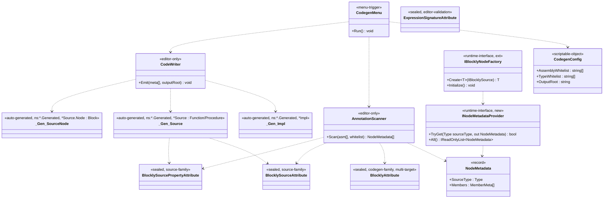

## 定位

Blockly Editor 工具链。Editor 期扫描 Runtime 程序集 + 白名单注解，生成 `IProcedureImpl` / `IFunctionImpl` 胶水代码与节点元数据；运行期通过 `IBlocklyNodeFactory.Initialize()` 反射注册一次。

父模块 §7 非冻结清单第 1/2/3/4/7 项由本子模块锁。

## Class Diagram

**依赖单向**：`Editor → Runtime`；`Runtime → Editor` 禁止。`INodeMetadataProvider` / 产物三件套均落 Runtime；产物**通过命名空间 `<SourceNs>.Generated` 自识别身份**（无 marker attribute），词汇由 Editor 合约 §1、§2 锁。

> **工具类命名规则**（KD#11）：Editor codegen 内部工具类不携带 `Ugc` 前缀，也不携带 `Blockly` 前缀——裸名交给命名空间 `Vena.Blockly.Editor` 去区分。`Blockly*` 前缀专供 KD#7 注解族 4 件（`BlocklySource` / `BlocklySourceProperty` / `Blockly` / `ExpressionSignature`）。

## Key Decisions

1. codegen 模式 = Editor 菜单触发 `.cs` 写盘。
2. 落点推导：**per-source-class** = `<源类.cs 所在目录>/Generated/<源类名>.g.cs`（普通目录、入 git、文件头 `// <auto-generated>`）。产物文件路径 ≡ 命名空间 `<SourceNs>.Generated` 的末段映射。全局 Provider 产物另落点见 KD#12。
3. 白名单 = ScriptableObject `Editor/Config/CodegenConfig.asset`（程序集 + 类型双白名单）。
4. 反射注册 = `IBlocklyNodeFactory.Initialize()` per-host 首次扫程序集 + 加载 `INodeMetadataProvider` 实现，幂等。
5. 新增运行期接口 = `INodeMetadataProvider`：`bool TryGet(Type sourceType, out NodeMetadata)` + `IReadOnlyList<NodeMetadata> All()`；生成代码实现、运行期消费。
6. 依赖 = Editor → Runtime 单向；Runtime → Editor 禁止；生成产物落 Runtime 目录、不引 Editor 命名空间。
7. **注解名锁（2 族 + 1 编辑器校验族；共 4 件）**：
   - **Source 族（手写 runtime 节点源 + 槽位）**：
     - `[BlocklySource(menuPath, nodeType)]`——`AttributeTargets.Class`，贴在手写的 runtime 节点源类（Expression / BehaviorNodeSource 子类）上、为节点注册托底。
     - `[BlocklySourceProperty(displayName, order)]`——`AttributeTargets.Field | AttributeTargets.Property`，贴在手写 Source 类的字段/属性上，描述槽位与 `order` 锁。
   - **Codegen 族（玩法代码标，给 codegen 生成胶水）**：
     - `[Blockly(displayName)]` / `[Blockly(displayName, isStatic, params parameterNames)]`——**multi-target**：`AttributeTargets.Class | Method | Property | Field`。scanner 用 `MemberInfo.MemberType` 分支处理 Class / Method / Property / Field；其中 `isStatic` / `parameterNames` **仅 Method target 有意义**，其他 target 上由 scanner 忽略。
   - **编辑器校验族（不动）**：`[ExpressionSignature]` / `[ExpressionSignature(returnType)]` / `[ExpressionSignature(returnType, params Type[])]`——`AttributeTargets.Field | Property`，LogicGraph 槽位签名约束，仅供编辑器连接期校验。
   - **联动字段（4 件统一）**：全部 `sealed`、`Inherited=false, AllowMultiple=false`。
   - **产物身份 = 命名空间隔离（无 attribute marker）**：产物三件套全部落 `<SourceNs>.Generated` 命名空间、人类一眼即辨「这是产物」；IDE / grep / stack trace 都以 `*.Generated` 为产物身份判据。**不再使用任何 `[BlocklyGenerated]` attribute**——原「输出 marker」设计作废、attribute 与词汇不再存在。详见 KD#12。
   - **Q1 硬约束（scanner 层 hard fail，详见合约 §2「scanner 硬约束」）**：
     1. 同一类上 `[Blockly]` 与 `[BlocklySource]` 不允许同存——两族正交、混标语义未定义。
     2. `[Blockly]` 不允许打在「runtime 节点源类」上——即继承自 `Vena.Blockly.Expression` 或 `Vena.Blockly.BehaviorNodeSource` 的类不可携 `[Blockly]`；嵌套 Node 实现类的基类 `Vena.Blockly.Block<TSource>` / `Vena.Blockly.BehaviorNode<TSource, TImpl>` 同列。
     3. 违者由 `AnnotationScanner` 抛 `InvalidOperationException("[Vena.Blockly] {TypeFullName}: [Blockly] 不允许与 [BlocklySource] 同存 / 不允许打在 runtime 节点类")`，整个 codegen run 中止，错误信息显式包含违例类型全名以方便定位。
   - **废除注解清单**：
     - `[BlocklyCodeGen]` / `[BlocklyClass]` → 并入 `[Blockly]`（Class target）。
     - `[BlocklyCodeGenMethod]` / `[BlocklyMethod]` → 并入 `[Blockly]`（Method target）。
     - `[BlocklyCodeGenMember]` / `[BlocklyProperty]` → 并入 `[Blockly]`（Property / Field target）。
     - `[BlocklyGenerated]` → 无取代，产物身份走命名空间隔离（KD#12）。
     - `[BlocklySourceSlot]` → 改名 `[BlocklySourceProperty]`（沿用 GUID，git mv）。
8. **codegen 产物三件套**：`*Impl`（0-arity `IFunctionImpl<TOutput>` / `IProcedureImpl`） + `*Source`（0 泛型 arity `Function<*Impl, TOutput>` / `Procedure<*Impl>`） + `*Source.Node`（`Block<*Source>` 子类，手动 Pop）。三件均落 `<SourceNs>.Generated` 命名空间、`<SourceDir>/Generated/<源类名>.g.cs` 文件。Pop 顺序 ≡ IR 顺序 ≡ UI 顺序 ≡ `[BlocklySourceProperty.order]` 升序（Pop = LIFO 反序）。实例方法示例源类落点：`Tests/04_Codegen/Scripts/InstanceMethod.cs`，产物落点：`Tests/04_Codegen/Scripts/Generated/InstanceMethod.g.cs`。
9. **发布者身份字样**（`.g.cs` 顶部文件头）：产物文件头身份字样 = `"Generated by the com.vena.blockly Blockly codegen pipeline."`；合约 §2 产物文件头 hard rule 锁定，仅保留 `<auto-generated>` 7 行 prelude、**不再贴任何 `[BlocklyGenerated]` attribute**。**不提 `UGC`**——`UGC` 是产品语义（KD#2 runtime UGC 玩家），不作为工具身份。
10. **菜单路径**：`Tools/Vena/Blockly/Run Codegen` + `Tools/Vena/Blockly/Locate Codegen Config`；`[CreateAssetMenu] menuName = "Vena/Blockly/Codegen Config"`；资产默认文件名 `BlocklyCodegenConfig.asset`（资产文件名保留 `Blockly` 前缀以避免开发环境项目全局名冲突；类名 `CodegenConfig` 裸命名，由命名空间区分）。
11. **工具类命名规则**（Editor 内部）：Editor codegen 工具类不携带 `Ugc` 前缀、不携带 `Blockly` 前缀——裸名交给命名空间 `Vena.Blockly.Editor` 去区分。适用于：`AnnotationScanner` / `CodeWriter` / `CodegenMenu` / `CodegenConfig`。
    - **理由**：（1）命名空间已承载 Blockly 身份，类名重复前缀 = 命名冗余（C2/C5）；（2）`Blockly*` 前缀保留给 KD#7 注解族 4 件（`BlocklySource` / `BlocklySourceProperty` / `Blockly` / `ExpressionSignature`），不随意混入内部工具类名以维持「公开词汇 vs 内部工具」边界；（3）`Ugc` 是产品语义（KD#2 runtime UGC 玩家编辑器）、不可同时作为 Editor 期开发者工具的命名前缀——二者使用者不同（`Ugc` = 玩家；codegen = 开发者 + AI），混用会误导「工具供 UGC 玩家使用」。
    - **作用面**：仅 Editor 内部工具类；Runtime 内 `UGCWorld` 等产品语义概念不受本规则约束（依然保留 `UGC` 字样）。
12. **产物身份 = 固定后缀命名空间隔离**（取代 `[BlocklyGenerated]`）：
    - **命名空间规则**：对源类 `T`（`T.Namespace = <SourceNs>`）的所有产物 = `namespace <SourceNs>.Generated { ... }`。例源类 `Vena.Blockly.Tests.Codegen.InstanceMethod` → 产物 `namespace Vena.Blockly.Tests.Codegen.Generated`；产物类全限定名 `Vena.Blockly.Tests.Codegen.Generated.InstanceMethodTestMethod` / `.InstanceMethodTestMethodImpl`。选型理由 = (a) 同名碰撞自动消解（跨业务域 `Order.Process` 不互撞）；(b) IDE 入眼即辨「末段 `.Generated` = 产物」；(c) 与源类同 root 包，`using` 路径连贯。
    - **文件路径规则**：产物文件落 `<SourceDir>/Generated/<源类名>.g.cs`（文件夹 ≡ 命名空间末段，C# 业界惯例）。例：`Tests/04_Codegen/Scripts/InstanceMethod.cs` 源 → `Tests/04_Codegen/Scripts/Generated/InstanceMethod.g.cs` 产物。`<SourceDir>` 由 scanner 从 `Type.Assembly.Location` + asmdef 路径解析出。
    - **Provider 产物例外**：`GeneratedNodeMetadataProvider.g.cs` 跨源类聚合、不属于任一 `<SourceNs>`；落点 = `CodegenConfig.OutputRoot`（默认 `${PackagePath}/Runtime/Generated/`）；命名空间 = `Vena.Blockly.Generated`（固定根、作为 Provider 只点身份区分）。仅 Provider 一个产物使用该根 ns，三件套不走这里。
    - **scanner 过滤契约**：**仅**一条「`type.GetCustomAttribute<BlocklyAttribute>() != null && memberType == Class`」，不加 belt-and-suspenders。产物 `*Source` / `*Impl` / `*Source.Node` / Provider 均不贴 `[Blockly]` → 天然不命中过滤、不发生递归 codegen。「防递归生成」是伪需求。**保留**：`[BlocklySource]` 跳过（`AnnotationScanner.cs` 现第 54 行），语义为「手写运行期节点源不是 codegen 输入」的正交过滤、非防递归防御。
    - **scanner 旧「跳过 `[BlocklyGenerated]`」删除**：`AnnotationScanner.cs` 第 55 行 `if (type.GetCustomAttribute<BlocklyGeneratedAttribute>() != null) continue;` 整行删除。
    - **AOT 不变量契约**（锁合约 §4.6 第 1 条修订）：`sourceType` 解析限于「携 `[BlocklySource]` 且命名空间末段为 `.Generated` 」的产物 `*Source` 与手写 Source；原「+ `[BlocklyGenerated]`」词汇废。

## Phase 2 Ratchet

**做**：

1. PR-1：注解定型 + ScriptableObject 白名单容器。范围 = `[Blockly]` multi-target（合并旧 `[BlocklyCodeGen]` / `[BlocklyCodeGenMethod]` / `[BlocklyCodeGenMember]`）、`[BlocklySourceProperty]`（重命名自 `[BlocklySourceSlot]`）、`CodegenConfig` ScriptableObject、菜单骨架。**删除** `[BlocklyGenerated]` attribute 及其 `.meta`、`[BlocklyCodeGenMethod]` / `[BlocklyCodeGenMember]` 两个旧 attribute 及其 `.meta`。
2. PR-2：Editor 菜单 + 程序集扫描 + 产出三件套 → `<SourceDir>/Generated/<源类名>.g.cs`，命名空间 `<SourceNs>.Generated`。合约 §2 为准。包含：Demo 04 `Tests/04_Codegen/Scripts/InstanceMethod.cs` 源类在地重命名 `[BlocklyCodeGen]` → `[Blockly]` + `[BlocklyCodeGenMethod]` → `[Blockly]`；产物首次生成落 `Tests/04_Codegen/Scripts/Generated/InstanceMethod.g.cs`。
3. PR-3：`IBlocklyNodeFactory.Initialize()` 反射注册 + `INodeMetadataProvider` 装载（接口由§6 §5 锁：TryGet + All）。

**不做**：IR 序列化格式（Phase 2 第二刀）、编辑器 UI（Phase 2 第二刀）、Phase 3 AOT。

## Phase 3 锚

Phase 3 = AOT（IR → 原生 C# 代码）。Phase 2 IR 设计须保 AOT 友好（节点连接静态可推断、避免运行时动态分发埋入 IR 形态）。
