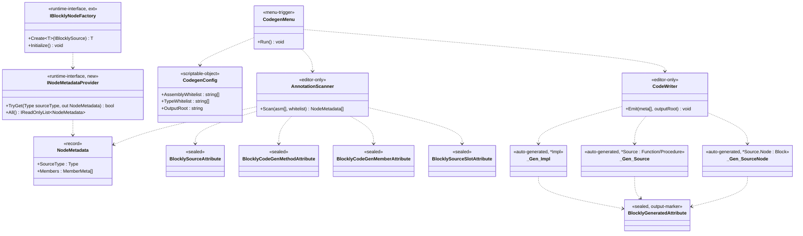

## 定位

Blockly Editor 工具链。Editor 期扫描 Runtime 程序集 + 白名单注解，生成 `IProcedureImpl` / `IFunctionImpl` 胶水代码与节点元数据；运行期通过 `IBlocklyNodeFactory.Initialize()` 反射注册一次。

父模块 §7 非冻结清单第 1/2/3/4/7 项由本子模块锁。

## Class Diagram

**依赖单向**：`Editor → Runtime`；`Runtime → Editor` 禁止。`INodeMetadataProvider` / `[BlocklyGenerated]` / 产物三件套均落 Runtime，其词汇由 Editor 合约 §1、§2 锁。

> **工具类命名规则**（KD#16）：Editor codegen 内部工具类不携带 `Ugc` 前缀，也不携带 `Blockly` 前缀——裸名交给命名空间 `Vena.Blockly.Editor` 去区分。`Blockly*` 前缀主属 KD#7 注解族。

## Key Decisions

1. codegen 模式 = Editor 菜单触发 `.cs` 写盘。
2. 落点 = `Runtime/Generated/`（普通目录、入 git、文件头 `// <auto-generated>`）。
3. 白名单 = ScriptableObject `Editor/Config/CodegenConfig.asset`（程序集 + 类型双白名单）。
4. 反射注册 = `IBlocklyNodeFactory.Initialize()` per-host 首次扫程序集 + 加载 `INodeMetadataProvider` 实现，幂等。
5. 新增运行期接口 = `INodeMetadataProvider`：`bool TryGet(Type sourceType, out NodeMetadata)` + `IReadOnlyList<NodeMetadata> All()`；生成代码实现、运行期消费。
6. 依赖 = Editor → Runtime 单向；Runtime → Editor 禁止；生成产物落 Runtime 目录、不引 Editor 命名空间。
7. **注解名锁（两族一标记）**：
   - **CodeGen 输入族**（用户贴在手写源代码上、路由 codegen 生成什么）：`BlocklyCodeGen` / `BlocklyCodeGenMethod` / `BlocklyCodeGenMember`。
   - **Source 输入族**（用户贴在手写 runtime 节点类/字段上、作为 codegen 扫描原料）：`BlocklySource` / `BlocklySourceSlot`。
   - **输出 marker（独占前缀 `BlocklyGenerated`）**：`BlocklyGenerated`（仅此一件）——codegen 贴在产物类上的输出面标签，表示「这个类由 Blockly 工具生成」。**不入 `BlocklyCodeGen*` 前缀族**：输入族描述「要生成什么」、输出 marker 描述「已生成出什么」，两件事、两个名字空间。`BlocklyGenerated` 独占前缀 = 一眼可辨「这是产物身份、不是输入手子」。
   - **联动字段**：所有上述 + 类级 `BlocklyCodeGen` + 签名 `ExpressionSignature` + 标记 `BlocklyGenerated` 全部 `sealed`、`Inherited=false, AllowMultiple=false`。
8. **codegen 产物三件套**：`*Impl`（0-arity `IFunctionImpl<TOutput>` / `IProcedureImpl`） + `*Source`（0 泛型 arity `Function<*Impl, TOutput>` / `Procedure<*Impl>`） + `*Source.Node`（`Block<*Source>` 子类，手动 Pop）。Pop 顺序 ≡ IR 顺序 ≡ UI 顺序 ≡ `[BlocklySourceSlot.order]` 升序。实例方法示例落点：`Tests/04_Codegen/Scripts/InstanceMethod.cs`（Demo 04 代码生成测试内，取代原 `Samples/Expression/InstanceMethod.cs`）。
9. **发布者身份字样**（`.g.cs` 顶部文件头）：产物文件头身份字样 = `"Generated by the com.vena.blockly Blockly codegen pipeline."`；合约 §2 三件套产物文件头 hard rule 锁定。**不提 `UGC`**——`UGC` 是产品语义（KD#2 runtime UGC 玩家），不作为工具身份。
10. **菜单路径**：`Tools/Vena/Blockly/Run Codegen` + `Tools/Vena/Blockly/Locate Codegen Config`；`[CreateAssetMenu] menuName = "Vena/Blockly/Codegen Config"`；资产默认文件名 `BlocklyCodegenConfig.asset`（资产文件名保留 `Blockly` 前缀以避免开发环境项目全局名冲突；类名 `CodegenConfig` 裸命名，由命名空间区分）。
11. **工具类命名规则**（Editor 内部）：Editor codegen 工具类不携带 `Ugc` 前缀、不携带 `Blockly` 前缀——裸名交给命名空间 `Vena.Blockly.Editor` 去区分。适用于：`AnnotationScanner` / `CodeWriter` / `CodegenMenu` / `CodegenConfig`。
    - **理由**：（1）命名空间已承载 Blockly 身份，类名重复前缀 = 命名冗余（C2/C5）；（2）`Blockly*` 前缀保留给 KD#7 注解族，不随意混入内部工具类名以维持「公开词汇 vs 内部工具」边界；（3）`Ugc` 是产品语义（KD#2 runtime UGC 玩家编辑器）、不可同时作为 Editor 期开发者工具的命名前缀——二者使用者不同（`Ugc` = 玩家；codegen = 开发者 + AI），混用会误导「工具供 UGC 玩家使用」。
    - **作用面**：仅 Editor 内部工具类；Runtime 内 `UGCWorld` 等产品语义概念不受本规则约束（依然保留 `UGC` 字样）。

## Phase 2 Ratchet

**做**：

1. PR-1：注解定型 + ScriptableObject 白名单容器。范围 = `[BlocklyGenerated]`（`Runtime/Host/Attributes/BlocklyGeneratedAttribute.cs`、sealed marker）、`CodegenConfig` ScriptableObject、菜单骨架。不变动其他 6 个注解。
2. PR-2：Editor 菜单 + 程序集扫描 + 产出三件套 → `Runtime/Generated/<源类名>.g.cs`。合约 §2 为准。包含：Demo 04 `Tests/04_Codegen/Scripts/InstanceMethod.cs` 覆写（取代现手写 Impl/Source/Node 部分、源类 `InstanceMethod` 保留、完成原文件 TODO）；不另开 `Tests/Editor/`。原 `Samples/Expression/InstanceMethod.cs` 迁入 Demo 04 后为本 PR 覆写起点（具体迁移由 programmer 负责、本领域只锁产物路径）。
3. PR-3：`IBlocklyNodeFactory.Initialize()` 反射注册 + `INodeMetadataProvider` 装载（接口由§6 §5 锁：TryGet + All）。

**不做**：IR 序列化格式（Phase 2 第二刀）、编辑器 UI（Phase 2 第二刀）、Phase 3 AOT。

## Phase 3 锚

Phase 3 = AOT（IR → 原生 C# 代码）。Phase 2 IR 设计须保 AOT 友好（节点连接静态可推断、避免运行时动态分发埋入 IR 形态）。
