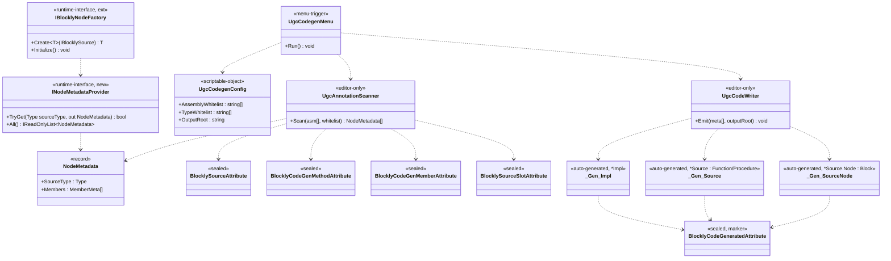

## 定位

Blockly UGC 工具链。Editor 期扫描 Runtime 程序集 + 白名单注解，生成 `IProcedureImpl` / `IFunctionImpl` 胶水代码与节点元数据；运行期通过 `IBlocklyNodeFactory.Initialize()` 反射注册一次。

父模块 §7 非冻结清单第 1/2/3/4/7 项由本子模块锁。

## Class Diagram

**依赖单向**：`Editor → Runtime`；`Runtime → Editor` 禁止。`INodeMetadataProvider` / `[BlocklyCodeGenerated]` / 产物三件套均落 Runtime，其词汇由 Editor 合约 §1、§2 锁。

## Key Decisions

1. codegen 模式 = Editor 菜单触发 `.cs` 写盘。
2. 落点 = `Runtime/Generated/`（普通目录、入 git、文件头 `// <auto-generated>`）。
3. 白名单 = ScriptableObject `Editor/Config/UgcCodegenConfig.asset`（程序集 + 类型双白名单）。
4. 反射注册 = `IBlocklyNodeFactory.Initialize()` per-host 首次扫程序集 + 加载 `INodeMetadataProvider` 实现，幂等。
5. 新增运行期接口 = `INodeMetadataProvider`：`bool TryGet(Type sourceType, out NodeMetadata)` + `IReadOnlyList<NodeMetadata> All()`；生成代码实现、运行期消费。
6. 依赖 = Editor → Runtime 单向；Runtime → Editor 禁止；生成产物落 Runtime 目录、不引 Editor 命名空间。
7. 注解 4 类（`BlocklySource` / `BlocklyCodeGenMethod` / `BlocklyCodeGenMember` / `BlocklySourceSlot`）+ 类级 `BlocklyCodeGen` + 签名 `ExpressionSignature` + 标记 `BlocklyCodeGenerated` 全部 `sealed`、`Inherited=false, AllowMultiple=false`。
8. **codegen 产物三件套**：`*Impl`（0-arity `IFunctionImpl<TOutput>` / `IProcedureImpl`） + `*Source`（0 泛型 arity `Function<*Impl, TOutput>` / `Procedure<*Impl>`） + `*Source.Node`（`Block<*Source>` 子类，手动 Pop）。Pop 顺序 ≡ IR 顺序 ≡ UI 顺序 ≡ `[BlocklySourceSlot.order]` 升序。实例方法示例落点：`Tests/04_Codegen/Scripts/InstanceMethod.cs`（Demo 04 代码生成测试内，取代原 `Samples/Expression/InstanceMethod.cs`）。

## Phase 2 Ratchet

**做**：

1. PR-1：注解定型 + ScriptableObject 白名单容器。范围 = `[BlocklyCodeGenerated]`（`Runtime/Host/Attributes/BlocklyCodeGeneratedAttribute.cs`、sealed marker）、`UgcCodegenConfig` ScriptableObject、菜单骨架。不变动其他 6 个注解。
2. PR-2：Editor 菜单 + 程序集扫描 + 产出三件套 → `Runtime/Generated/<源类名>.g.cs`。合约 §2 为准。包含：Demo 04 `Tests/04_Codegen/Scripts/InstanceMethod.cs` 覆写（取代现手写 Impl/Source/Node 部分、源类 `InstanceMethod` 保留、完成原文件 TODO）；不另开 `Tests/Editor/`。原 `Samples/Expression/InstanceMethod.cs` 迁入 Demo 04 后为本 PR 覆写起点（具体迁移由 programmer 负责、本领域只锁产物路径）。
3. PR-3：`IBlocklyNodeFactory.Initialize()` 反射注册 + `INodeMetadataProvider` 装载（接口由§6 §5 锁：TryGet + All）。

**不做**：IR 序列化格式（Phase 2 第二刀）、编辑器 UI（Phase 2 第二刀）、Phase 3 AOT。

## Phase 3 锚

Phase 3 = AOT（IR → 原生 C# 代码）。Phase 2 IR 设计须保 AOT 友好（节点连接静态可推断、避免运行时动态分发埋入 IR 形态）。

