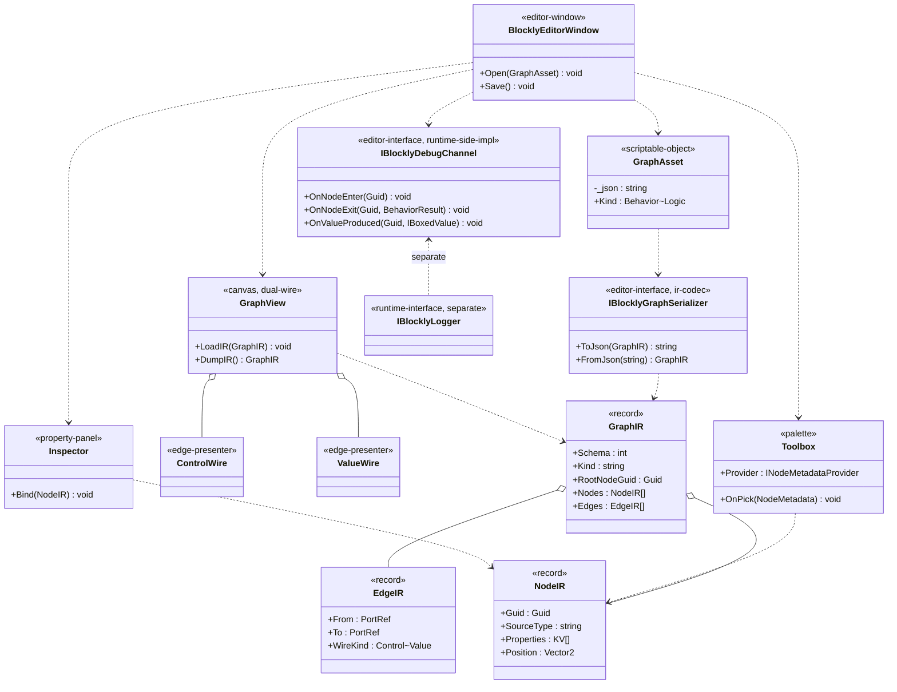

## 定位

Blockly UGC 编辑器 UI。承载画布（GraphView 双 wire 单画布）、Toolbox（消费 `INodeMetadataProvider`）、Inspector、IR 资产工作流（`GraphAsset` 序列化/反序列化驱动）与调试通道 v0。

父模块 §7 非冻结清单第 4 项（编辑器入口）由本子模块锁；§7 第 3 项（IR 序列化）由 Editor 顶层 §4 锁、本模块为消费方。

## Class Diagram

**依赖单向**：`Editor.UI → Editor (注解+IR Schema 词汇) → Runtime (只读)`；`Runtime → Editor.UI` 禁止；`IBlocklyGraphSerializer` / `IBlocklyDebugChannel` 不进父 §6 聚合门面（`IBlocklyHost`）。

## Key Decisions

1. 画布 = 单 GraphView 双 wire（`ControlWire` / `ValueWire` 同图，`EdgeIR.WireKind` 显式标记，无默认）。
2. IR 载体 = `GraphAsset` ScriptableObject + 单字段 `[SerializeField] string _json`；Unity 序列化只触发整串 round-trip、不参与字段级 diff。
3. IR 编解码 = `IBlocklyGraphSerializer`（Editor 期接口）；不复用 Runtime `IBlocklySerializer`（字节流原语）；不进父 §6 聚合。
4. Toolbox 数据源 = `INodeMetadataProvider.All()`（codegen 生成、Runtime 实现）；菜单分层切自 `[BlocklySource.menuPath]` 原值。
5. Inspector 数据源 = `NodeIR.Properties`（kv 直绑）；编辑后回写 IR、不直接持有运行期实例。
6. 调试通道 v0 = `IBlocklyDebugChannel`（Editor 期接口、Runtime 侧实现注入）；与 `IBlocklyLogger` 分离原因 = 调试目标（可视化标定 / 命中节点高亮）≠ 日志目标（文本流），不同变更原因；**不进父 §6 聚合**。
7. 顶层菜单 = 单入口 `Window/Vena/Blockly Editor`；新建 `GraphAsset` = `Assets/Create/Vena/Blockly/Behavior Graph` & `Logic Graph` 两项。
8. 资产工作流 = 打开 `GraphAsset` 入 `BlocklyEditorWindow`；`Save()` 走 `IBlocklyGraphSerializer.ToJson` → 写 `_json` 字段、`SetDirty` + `SaveAssets`。

## Phase 2 Ratchet

**第二刀范围**（6 PR）：

1. PR-4：IR 类型定义（`GraphIR` / `NodeIR` / `EdgeIR` records）+ `IBlocklyGraphSerializer` 接口；落 Editor 顶层合约 §4。
2. PR-5：`GraphAsset` ScriptableObject + 单字段 `_json` 序列化；`Assets/Create` 双菜单。
3. PR-6：Runtime IR 加载器（`IBlocklyHost` 装载 `GraphAsset` → 反序列化 → 节点工厂 `Create`）；不动 `IBlocklyHost` 聚合形态。
4. PR-7：`BlocklyEditorWindow` + `GraphView` 双 wire 单画布；`LoadIR` / `DumpIR` 完整 round-trip。
5. PR-8：`Toolbox`（消费 `INodeMetadataProvider`）+ `Inspector`（绑 `NodeIR.Properties`）。
6. PR-9：`IBlocklyDebugChannel` v0 接口 + Runtime 侧最小实现（节点 Enter/Exit/ValueProduced 三事件）；不进父 §6。

**不做**：父 §6 聚合扩展、Phase 3 AOT、节点级 undo 栈（v0 仅资产级 Ctrl+Z）、多画布并存。
