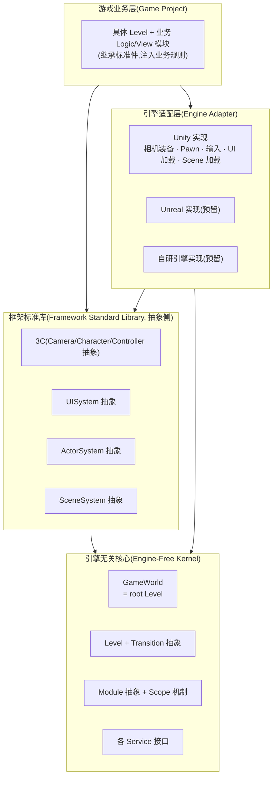
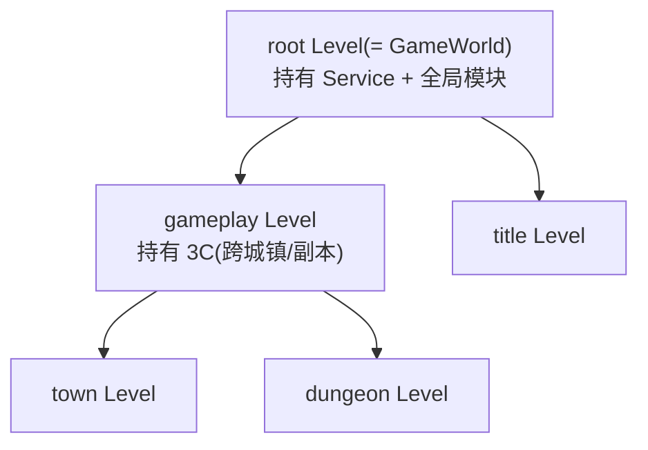
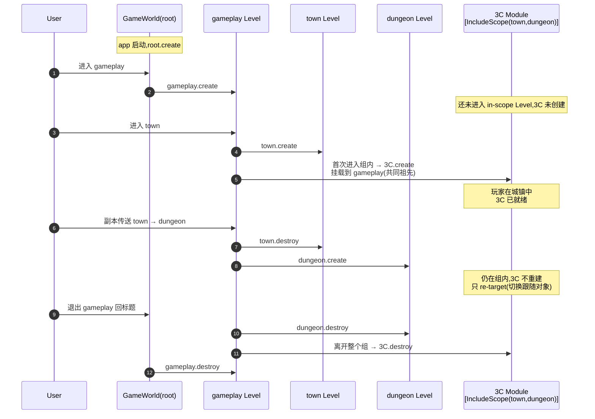
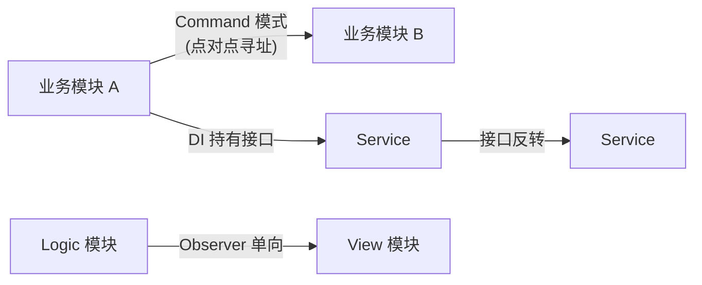

# Vena.framework 目标架构(Target Architecture, DRAFT)

> **状态:** DRAFT,待 owner 评审。
> **作用:** 本文是经 owner 与 architect 逐条对齐后**锁定的目标架构基线**(target-state baseline)。后续整改、conformance 检查、新增模块的合规判定,都以本文为准绳。
> **写作语言:** 中文(对齐既有设计稿与代码注释)。
> **范围:** Vena.framework(及其依赖的 Vena.core / Vena.world / Vena.math)。**不涉及**具体业务游戏(那是 framework 之上的事)。
> **与既存代码的关系:** 当前 framework 中的 `GameWorld.GUI.cs` / `GameWorld.SceneController.cs` / `GameWorld.Character.cs` 等 partial 是**遗留耦合**,目标态要求剥离;详见末尾"差距摘要"。

---

## 0. 目录

1. 概述与定位
2. 三条铁律(Bedrock Laws)
3. 分层包结构(图)
4. Level 树 与 Module Scope/Lifecycle 统一模型
5. 三类 Module(Service / Logic / View)与 Kind × Scope 两轴
6. 3C / Character / GameMode 定位
7. 四种交互协议
8. 反模式清单
9. 开放待定项(TBD)
10. 与当前代码的差距摘要

---

## 1. 概述与定位

### 1.1 Vena 是什么

Vena 是一套**引擎无关的游戏框架**。它的核心承诺有两条:

- **可移植** —— 编排内核与框架标准库都不绑定具体游戏引擎,可在 Unity / Unreal / 自研引擎上以同一套抽象运行;引擎差异在适配层封装。
- **结构化** —— 用 Level 树 + Module 抽象 + 显式 Scope 机制,把"全局态/局部态/进入退出顺序/资源生命周期"这些常年混乱的问题,压成可追溯、可静态审计的固定形状。

### 1.2 内核 vs 标准库 —— 一个关键区分

> **Vena.framework = GameWorld 内核 + 框架标准库(3C / UISystem / ActorSystem / SceneSystem 抽象侧)。**

这是 Vena 与 "通用 IoC 容器 + 调度器" 的本质差别:

- **GameWorld 内核** —— 极小、纯粹、引擎无关。只管 Level / Module / Transition 三件事。
- **框架标准库** —— 一等公民式的标准件(3C、UISystem、ActorSystem、SceneSystem 等)。这些是"能够被称为游戏框架"的关键 —— 没有它们,Vena 只是个容器;有了它们,Vena 才是 framework。
- **引擎适配层** —— 把上述抽象映射到具体引擎(Unity / Unreal / …)。

业务游戏在最上层,**继承标准件、注入引擎实现**,而不是从零搭建。

### 1.3 设计目标(简述)

| 维度 | 目标 |
|---|---|
| 引擎可移植 | 内核与标准库抽象侧 noEngineReferences;Unity/Unreal 仅作为可替换适配层 |
| 生命周期可追溯 | 任意模块的生死边界 = 它 scope Level 的生死边界 × 它的 Kind;启动时输出审计清单 |
| 单向依赖 | 业务态(Logic) → 视图(View) 单向;Service ↔ Service 经接口反转;不允许反向 |
| 高内聚低耦合 | 模块间通过依赖注入持有接口、Command 寻址通信;禁止全局单例 / 全局 RPC 总线 |

---

## 2. 三条铁律(Bedrock Laws)

> 这三条是**不可妥协的**。任何与之冲突的"权宜之计",在 conformance 审查中一律判为违例。

### 铁律 1 —— GameWorld 是纯粹、引擎无关的编排内核

**职责清单(穷举):**

1. **Level 管理** —— 维护 Level 树,持有 root Level(=GameWorld 自身)。
2. **Module 抽象** —— 定义 Module 基类/接口、生命周期钩子、注册与解析机制。
3. **Level Transition** —— 编排 Level 切换次序的纯逻辑对象。

**Transition 是纯逻辑对象。** 它只负责"先 unfocus 旧 Level,再 create 新 Level,再 focus 新 Level"这种**次序编排**,**不**承担加载动画、淡入淡出、Loading 界面等任何视图实现。视图侧的过场效果由 ViewModule(订阅 transition 事件)实现。

**约束:**

- GameWorld 所在程序集(`Vena.framework.GameWorld` 或等价单元)**禁止引用任何引擎程序集**(`UnityEngine.*` / `UnrealEngine.*` / …)。在 Unity 侧通过 asmdef 的 `noEngineReferences: true` 强制。
- GameWorld **零视图层实现**。当前 partial 中的 `GUI.cs`(UI 加载/卸载逻辑)、`SceneController.cs`(Unity Scene 加载)、`Character.cs`(玩家角色单例)等,**必须从 GameWorld 剥离**,降为引擎特定的 Service / View 模块。
- GameWorld **只持有它们的抽象(接口)**,经 DI 拿到具体实现,管它们的生命周期,**不直接调用引擎 API**。

### 铁律 2 —— Vena.framework 自带基础 3C 框架作为一等标准件

**3C = Camera + Character + Controller。**

- **3C 抽象**(基类 + 接口 + 默认装配)进**引擎无关核心**(noEngineReferences),跨引擎可移植。
- **3C 引擎具体实现**(Unity 相机装备 / Pawn / 输入采集)进**引擎适配层**,经接口注入。

**这是 Vena 与通用容器的分界线。** 一个游戏框架若不提供基础 3C,业务团队每个项目都要重造,框架就退化成了"调度器 + IoC"。

3C 之外的标准库成员(UISystem / ActorSystem / SceneSystem / …)同此处理:抽象侧入核心,具体侧入适配层。

### 铁律 3 —— GameWorld 即 root Level;所有 Module 归属某个 Level;Module 生命周期 = 其 scope Level 的生命周期

这一条消除了"全局模块"作为独立机制 ——

> "全局" 不再是一种特殊的生命周期带,**它只是"归属永不销毁的 root Level"**。

**展开:**

- GameWorld 同时**就是** root Level。它从应用启动到关闭一直存活。
- 任意 Module 必有且只有一个**所属 scope**。未显式声明 scope 的 Module,默认归属 root(等价于"全局")。
- Service 与"全局模块"统一归属 root。它们与 root 同生同死,看起来"全局",但机制上**没有**特殊。

**收益:** 整个生命周期模型坍缩成一句话 —— "模块的命 = 它 Level 的命"。不再需要"应用级模块"/"会话级模块"/"关卡级模块"这种分带建模。

---

## 3. 分层包结构

### 3.1 四层



**依赖方向(单向,不可反转):** 业务 → 适配 → 标准库 → 内核。

### 3.2 与现有 Vena 包的对应

| 现有包 | 目标层 | 备注 |
|---|---|---|
| `com.vena.core` | L1 内核(部分)/ L2 标准库(部分) | 干净地基,保留 |
| `com.vena.world` | L1 内核 | 编排域(GameWorld / Level / Module / Transition) |
| `com.vena.math` | L1 内核 | 纯数学,无引擎 |
| `com.vena.framework` | **拆分** | 抽象侧入 L1/L2(noEngineReferences);Unity 耦合下沉到 L3 适配层 |
| `com.vena.framework.unity`(目标) | L3 引擎适配层 | 当前 framework 中所有 `using UnityEngine;` 的实现迁来此处 |

**关键约束:**

- L1、L2 的 asmdef 必须 `noEngineReferences: true`。
- L3 的 asmdef 引用 L1/L2 的接口,**不允许 L1/L2 反向引用 L3**。
- 程序集命名建议:`Vena.Framework.Core`(L1)、`Vena.Framework.Standard`(L2)、`Vena.Framework.Unity`(L3)、`<GameName>.Game`(L4)。

---

## 4. Level 树 与 Module Scope / Lifecycle 统一模型

### 4.1 Level 树是什么

Level 是**作用域容器**。Level 之间可以嵌套,形成一棵以 GameWorld 为根的树:



- **root Level** —— 即 GameWorld。永不销毁。承载 Service、UISystem、Localization 等"全局"模块。
- **中层 Level**(如 `gameplay`)—— 表示"一段连贯的游戏过程"。承载 3C、玩家会话状态等"跨子 Level、不应重建"的模块。
- **叶子 Level**(如 `town` / `dungeon`)—— 具体场景。承载只属于该场景的 Logic/View 模块。

### 4.2 两个正交维度

> 一个 Module 的生命周期由两个**正交**维度共同决定。文档里、代码里、心智里都不要把它们混成一维。

| 维度 | 含义 | 决定 | 由谁声明 |
|---|---|---|---|
| **Scope** | 模块归属哪个 Level | **何时存在**(create / destroy 边界) | `[IncludeScope]` / `[ExcludeScope]` Attribute,默认 root |
| **Kind** | 模块是 Service / Logic / View | **在所属 Level 的哪个事件上生死** | 模块继承的基类 / 实现的接口 |

**统一公式:**

```
Module.lifetime  =  Scope_Level.lifetime  ×  Kind_Hooks
```

其中:

- **Logic / Service** 模块:绑定 Scope Level 的 `create → destroy` 事件。
- **View** 模块:绑定 Scope Level 的 `focus → unfocus` 事件。

> root Level 永远 focused(永远是当前激活路径的祖先),所以挂在 root 的 view 模块也常驻 —— 这与"全局 UI"的直觉吻合,且无需特例。

### 4.3 Scope 机制 —— `[IncludeScope]` / `[ExcludeScope]`

```csharp
// 白名单:声明该模块属于哪些 Level
[AttributeUsage(AttributeTargets.Class)]
public sealed class IncludeScopeAttribute : Attribute {
    public IncludeScopeAttribute(params Type[] levelTypes) { ... }
}

// 黑名单:全局减去这几个 Level
[AttributeUsage(AttributeTargets.Class)]
public sealed class ExcludeScopeAttribute : Attribute {
    public ExcludeScopeAttribute(params Type[] levelTypes) { ... }
}
```

**默认规则:** 未标注任何 scope attribute 的 Module → 归属 **root**(等价"全局")。

**精确语义(锁定):**

#### 4.3.1 单 Level scope

`[IncludeScope(typeof(TownLevel))]` —— 模块只属于 `TownLevel`。
- 进入 `TownLevel` 时 **create**。
- 离开 `TownLevel` 时 **destroy**。
- 不在 `TownLevel` 中时不存在。

#### 4.3.2 多 Level scope —— "组语义"

`[IncludeScope(typeof(TownLevel), typeof(DungeonLevel))]` —— 模块属于 `{Town, Dungeon}` **这一组** Level。

- **Create:** 进入组内**首个** in-scope Level 时创建。
- **组内切换:** Town → Dungeon 切换时,**模块不重建**(典型用例:**副本传送 3C 不重建,只重新 target**)。
- **Destroy:** 离开整个组(目标 Level 既不是 Town 也不是 Dungeon)时销毁。

> 直觉模型:Include 多个 Level 等价于"我以这组 Level 的并集为我的存在区间"。

#### 4.3.3 与 Level 树的映射规则

当声明的 Include 集合横跨多个分支时,模块应**挂载在能覆盖整个 in-scope 集合的、最近的祖先 Level** 上。

> 形式化:`mountLevel = 最近共同祖先(in-scope Levels)`,但若该共同祖先并不在 in-scope 集合内,模块挂在它上面也是合法的(挂载点用于持有模块实例,scope 用于决定何时存在)。

#### 4.3.4 `[ExcludeScope]` 同理取反

`[ExcludeScope(typeof(TitleLevel))]` —— 模块在除了 `TitleLevel` 之外的所有 Level 都存在。
- 等价于"挂 root,但在 TitleLevel 路径激活时挂起销毁"。
- 取反规则与 Include 对称:进入 excluded Level 时 destroy,离开时若再次进入"非 excluded"路径则 create。

#### 4.3.5 启动审计清单(强制)

GameWorld 启动时,必须扫描所有已注册的 Module 类型,输出审计清单,内容包含:

- 模块名 / 程序集 / Kind
- 解析得到的 Scope(显式 Attribute / 默认 root)
- 在 Level 树中的挂载点
- 预期的 create / destroy 触发边界

> 这呼应 Vena 对外承诺的"可追溯调用顺序"。审计清单产出之前,GameWorld 不允许进入第一帧。

### 4.4 副本传送图示(铁律 3 + 4.3.2 的合一示例)



### 4.5 已知设计张力(写进文档,不回避)

> **张力:** 强制业务程序员显式声明 scope,会增加心智负担。一个新建的 Module 类,作者必须想清楚"我属于哪段生命"才能写对 attribute。
>
> **取舍:** 为了换取**精细化生命周期控制 + 启动期可静态审计**,这点心智负担是值得付出的代价。"默认 root"已经为最常见情形(全局模块)消除了样板。
>
> **保留重审。** 暂无更优解。未来可能的减负方向(**仅记录,不实现**):
> - Roslyn analyzer:对未标注任何 scope attribute 的 Module 类发出 `info` 级提示("将被解析为 root scope,请确认"),帮助新人意识到这是个决策点。
> - 命名约定推断:类名含 `Global` / `Persistent` 前缀时默认 root;含具体 Level 名时尝试推断 —— 风险高,弱建议。

---

## 5. 三类 Module(Service / Logic / View)与 Kind × Scope 两轴

### 5.1 三类 Module

| Kind | 职责 | 生命钩子 | 典型 |
|---|---|---|---|
| **Service** | 跨业务的基础设施。不含游戏规则。Scope 接口反转。 | `create / destroy`(随 scope Level) | InputSystem、Localization、Networking、Logger |
| **Logic** | 业务态(state + rules)。引擎无关。 | `create / destroy`(随 scope Level) | CharacterLogic、CombatLogic、QuestLogic |
| **View** | 表现层(渲染 / UI / 音效触发)。引擎特定 OK。 | `focus / unfocus`(随 scope Level 是否在激活路径上) | CharacterView、HUDView、CutsceneView |

> Service vs Logic 的分界:**Service 不含业务规则**(给谁用都行),Logic **绑定具体游戏规则**(这游戏才有的玩法状态)。

### 5.2 Kind × Scope 矩阵(示例)

| 模块 | Kind | Scope | 生命解读 |
|---|---|---|---|
| InputSystem(Service) | Service | root(默认) | app 启动到关闭常驻 |
| Localization(Service) | Service | root | 同上 |
| HUD(View) | View | root | root 永远 focused → 常驻表现层 |
| CharacterLogic | Logic | `[IncludeScope(town, dungeon)]` | 副本传送不重建 |
| CharacterView | View | `[IncludeScope(town, dungeon)]` | 跟随 logic;切到 title 不渲染 |
| TownNPCLogic | Logic | `[IncludeScope(town)]` | 只在城镇 |
| DungeonHazardView | View | `[IncludeScope(dungeon)]` | 只在副本表现 |
| TitleMenuView | View | `[IncludeScope(title)]` | 只在标题画面 |

> 注意:两个维度独立。把"View" 当作 "Scope=root 的视图模块"是常见错误 —— 一个挂在 dungeon 的 ViewModule 同样合法,生命就是 "dungeon focus 时存在,unfocus 时销毁"。

---

## 6. 3C / Character / GameMode 定位

### 6.1 3C —— 框架标准模块组

3C(Camera + Character + Controller)是 framework **官方提供**的标准模块组,作为 L2 标准库的一等成员:

| 组件 | Logic 侧(L2 抽象,引擎无关) | View / Service 侧(L3 适配,引擎特定) |
|---|---|---|
| **Camera** | CameraLogic:目标、视角、约束、震屏意图 | CameraView:Unity Camera + 后处理装备 |
| **Character** | CharacterLogic:位置、朝向、状态机(可空) | CharacterView:Pawn / Mesh / 动画状态机 |
| **Controller** | ControllerLogic:输入意图(intent)→ 派发到 character/camera | InputSystem(Service):平台输入采集 → 转抽象意图 |

**典型挂载:** 3C 挂 `gameplay` 这层中间 Level(或更宽的祖先),用 `[IncludeScope(...)]` 跨城镇 / 副本 / 战斗子场景,实现"跨 Level 不重建"。

### 6.2 Character —— 不再是 GameWorld 的属性

**目标态硬性变更:**

> 删除 `GameWorld.character` 这种**静态单例式访问**。Character 是 3C 的一条腿,不是 GameWorld 的字段。

- 业务代码访问当前角色:经 DI 拿 `ICharacterLogic`(由 3C 标准件注册)。
- Character 可空:2D 棋牌、纯镜头探索、纯 UI 标题画面等场景,根本没有 Character —— 这是合法状态。

**开放待定:** Character 的概念边界尚未最终对齐,见 §9 TBD-1。

### 6.3 GameMode —— Level 内的子状态

**保留 GameMode 概念**,但定位明确:

> GameMode 是**某个 Level 内部的子状态**,共享父 Level 的 Logic / 持久模块,各自切换自己的 View / 子规则。

例:`gameplay` Level 内可以切换 `ExploreMode` / `CombatMode` / `DialogueMode`。三者共享 `gameplay` 上挂的 3C、玩家库存等 Logic,但各自的 HUD、操作映射、相机参数不同。

**机制定位:** GameMode 在生命周期上"借用"了 Level 的轨道 ——
- 与 Level 的 transition / focus 切换共用同一套事件机制;
- 与 Module 的 Kind × Scope 模型保持兼容(GameMode 切换 ≈ 更换一组 in-scope View 模块的子集)。

> 设计上,可把 GameMode 视为**第三条生命周期带**(在 Level / Module 之外)的一个轻量化形式 —— 它没有自己的 scope attribute 体系,而是借居于宿主 Level 之中。

---

## 7. 四种交互协议

每个箭头都有**唯一**协议。混用即违例。



| 关系 | 协议 | 要点 |
|---|---|---|
| **模块 → Service / 模块 → 模块(访问)** | **依赖注入,只持接口不持实现** | 构造时注入;不允许 `ServiceLocator.Get<X>()` 静态获取;不允许直接 `new` 实现类。 |
| **业务模块 ↔ 业务模块(行为调用)** | **Command 模式,点对点寻址** | Command 携带目标模块标识(类型 / id),由调度器分发。**不是**全局 RPC 总线,**没有**进程级串行锁。 |
| **Logic → View** | **Observer,单向** | View 订阅 Logic 的事件 / 状态投影。机制上保证单向:**View 不能反向 Fire 给 Logic**(只能通过用户输入 → Controller → Command → Logic 这条正路)。 |
| **Service ↔ Service** | **零业务,仅接口依赖反转** | Service 之间互调时,被调方提供接口,调用方持接口。不允许 Service 直接引用另一个 Service 的具体类。 |

### 7.1 Command 模式与全局 RPC 的差别

> 这是设计上**有意为之**的差异。

- **全局 RPC 总线(反模式):** 任何模块都可以 publish 任何消息;听众不可知;为保证一致性引入进程级锁;调用图不可静态推导。
- **Vena Command:** 每条 Command 显式指定目标(`SendCommand<TargetModule>(cmd)`);调度器只把消息送给目标;无需全局锁;调用图可静态分析。

代价是"我得知道我要发给谁",但这正是模块化的应有之义。

### 7.2 Logic → View 单向性的机制保证

候选机制(实现层面,本文不锁死):

- View 引用的是 Logic 的**只读投影接口**(`IReadOnly<TState>`),无 mutator。
- Command 通道仅允许"业务模块 → 业务模块(Logic / Service)",**禁止 View 作为 Command 发起方**(由分发器在注册时校验)。

---

## 8. 反模式清单(零容忍)

> 以下任意一项,在 conformance 审查中即判违例,无论"代码已经能跑"。

| # | 反模式 | 为什么禁止 |
|---|---|---|
| **AP-1** | 游离单例(`SomeService.Instance` / `static T Get<T>()`) | 绕过 GameWorld 的注册与生命周期管理,启动审计清单看不见;违反铁律 1、3。 |
| **AP-2** | OnEnter 过程式初始化(在 Level/Module 的 OnEnter 里手动 `new` 一坨子模块、按顺序拼装) | 模块图变隐式;依赖图不可静态推导;违反铁律 3 与"启动审计"承诺。 |
| **AP-3** | Logic 感知 View(Logic 类引用 View 类、调用 View 方法、订阅 View 事件) | 反转单向依赖;一旦发生,移植引擎或换 UI 框架时业务代码必裂。违反 §7。 |
| **AP-4** | 跨 Service 直接引用具体类(不走接口) | 破坏 Service ↔ Service 的依赖反转;一个 Service 替换实现就要改另一个。违反 §7、铁律 1。 |
| **AP-5** | 绕过 GameWorld 直接 `new Module` | Scope 机制失效;生命周期不归 GameWorld 管;启动审计清单看不见。违反铁律 3。 |
| **AP-6** | 在 GameWorld(L1)里出现 `using UnityEngine;` 或任何引擎 API | 破坏铁律 1 的可移植承诺。 |
| **AP-7** | Transition 里写视图过场(淡入淡出 / Loading 动画) | 违反铁律 1 中的"Transition 是纯逻辑对象";视图过场必须是订阅 transition 事件的 View 模块。 |
| **AP-8** | 把 GameMode 实现成独立 Level | 违反 §6.3:GameMode 是 Level 内部子状态,不是新 Level;若实现成 Level 会丢失"共享父 Level 持久模块"的语义。 |

---

## 9. 开放待定项(TBD)

> 以下条目**已识别但尚未锁定**,留给 owner 评审决议。每条注明影响范围。

### TBD-1 — Character 是"玩家化身"特指,还是"可控实体"基类?

**问题:** `Character` 这个词在不同游戏中含义不同 ——

- **狭义(玩家化身):** Character = 当前玩家操作的那个 Pawn。NPC、远程玩家、宠物各有各的类型。3C 中的 C 仅服务于"那一个"。
- **广义(可控实体基类):** Character = 任何"有位置、有状态、可被相机/控制器作用的实体"的基类。玩家、NPC、远程玩家都是 Character 的特化。

**影响:**

- 决定 `CharacterLogic` 抽象是 1 个 active 实例还是 N 个实例的集合。
- 决定 GameMode 切视角(玩家 → NPC观察)时,3C 是 re-target 同类型还是切换不同类型。
- 决定 `ActorSystem` 是否独立存在,以及它与 Character 的边界。

**架构师建议倾向:** 广义(基类)。理由:更小的核心抽象,玩家化身只是"当前 active character",特化由业务层完成;符合"标准件可被业务扩展"的设计意图。但**不锁定**,等 owner 决策。

### TBD-2 — Level Transition 的取消 / 回滚语义

**问题:** Transition 是"纯逻辑对象",但当 transition 期间出错(资源加载失败、上层取消)时:

- 是回滚到旧 Level(撤销已 unfocus 的事件)?
- 还是进入"错误 Level"(类似 fault state)?
- 还是终止应用?

**影响:** 失败处理策略、Transition 接口签名、相关 ViewModule 如何响应"取消"事件。

**当前文档不锁定。** 暂记为"实现期决定,以最简语义起步:fail-fast 进 fault Level"。

### TBD-3 — Roslyn analyzer 强度

§4.5 已记录"未来可能引入 analyzer 对未标注 scope 的模块发提示"。

- 是 `info`(温和提示)、`warning`(发布前清零)、还是 `error`(强制标注)?
- 是否对默认 root 行为视为"显式选择,不警告"?

**当前文档:仅记录方向,不实现。** owner 决定时机与强度。

### TBD-4 — 跨 Engine 的 Module 注册元数据格式

引擎适配层注入实现时,目标态希望"加载 Unity 实现包 → Unity-side 实现自动注册"。具体载体(asmdef-level 注册、源生成器、运行时反射扫描)未锁定。

**影响:** 启动期审计清单的实现路径。

---

## 10. 与当前代码的差距摘要

> 详细 conformance 报告由 architect 单独维护(待 owner 指定路径接入)。本节仅作整改入口。

### 10.1 内核污染(铁律 1 违反)

| 文件 | 问题 | 整改方向 |
|---|---|---|
| `GameWorld.GUI.cs`(partial) | UI 加载/卸载逻辑写在 GameWorld 上 | 抽出 `IUISystem` 接口入 L2;Unity 实现入 L3;GameWorld 经 DI 持有 |
| `GameWorld.SceneController.cs`(partial) | 直接调用 Unity Scene API | 抽出 `ISceneSystem` 接口入 L2;Unity 实现入 L3 |
| `GameWorld.Character.cs`(partial,`GameWorld.character` 静态) | Character 作为 GameWorld 字段 / 静态单例 | 删除字段;Character 由 3C 标准件管理;业务通过 DI 拿 `ICharacterLogic` |

### 10.2 引擎依赖(铁律 1 违反)

`com.vena.framework` 当前 asmdef 引用 `UnityEngine.*`,违反 noEngineReferences 承诺。

**整改:**

1. 拆分 `com.vena.framework` 为:
   - `Vena.Framework.Core`(L1,noEngineReferences:true)
   - `Vena.Framework.Standard`(L2,noEngineReferences:true)
   - `Vena.Framework.Unity`(L3,引用 UnityEngine,提供具体实现)
2. 现有所有 `using UnityEngine;` 文件按职责归属移入 L3。
3. 接口与抽象基类留在 L1/L2。

### 10.3 生命周期机制(铁律 3 + §4 违反)

当前若有"全局模块/会话模块"的特殊分支,统一收编为 root scope / 中层 Level scope,套用 `[IncludeScope]`。

**整改:**

1. 引入 `[IncludeScopeAttribute]` / `[ExcludeScopeAttribute]`(L1 内核)。
2. 实现启动期审计清单输出。
3. 现有模块逐个标注或采用默认 root。

### 10.4 3C 缺失(铁律 2 违反)

当前 framework 不提供 3C 标准件 —— 这是与"配称游戏框架"承诺最大的差距。

**整改:** 在 L2 标准库中实现 3C 抽象基类与默认装配;在 L3 Unity 适配层提供默认 Unity 实现。**这是 framework v1 的关键 milestone。**

### 10.5 交互协议偏差

排查项:

- 是否存在 `XxxService.Instance` 形式的静态访问?(AP-1)
- 是否存在 Logic 类直接 `using` View 类的情况?(AP-3)
- 是否存在跨业务模块直接方法调用(而非走 Command)?

整改优先级低于 10.1 ~ 10.4,但应在 framework v1 内全部清零。

---

## 附录 A — 名词表(快速查表)

| 名词 | 定义 |
|---|---|
| **GameWorld** | 引擎无关编排内核;同时是 root Level。 |
| **Level** | 作用域容器,可嵌套。Module 的归属单位。 |
| **Transition** | 编排 Level 切换次序的纯逻辑对象。零视图实现。 |
| **Module** | 由 GameWorld 注册管理的可插拔单元。三类:Service / Logic / View。 |
| **Scope** | Module 归属哪个 Level。由 `[IncludeScope]` / `[ExcludeScope]` 声明,默认 root。 |
| **Kind** | Module 的类别(Service / Logic / View),决定生命钩子是 create/destroy 还是 focus/unfocus。 |
| **3C** | Camera + Character + Controller,framework 标准模块组。 |
| **GameMode** | Level 内部的子状态;共享父 Level 的 Logic,切换自己的 View / 子规则。 |
| **Service** | 跨业务的基础设施模块,不含业务规则。 |
| **Logic** | 业务态模块,引擎无关。 |
| **View** | 表现层模块,可引擎特定。 |

---

*本文档为 DRAFT。owner 评审通过后转为 Vena.framework 的目标架构基线。*
